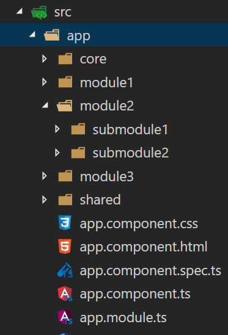
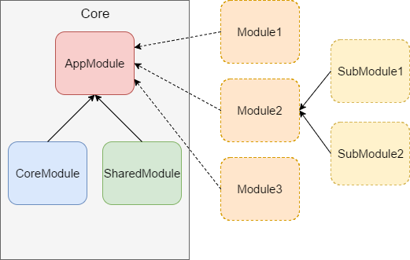
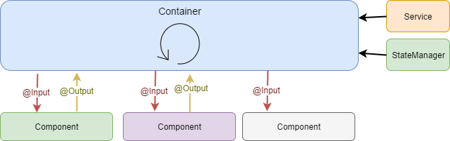
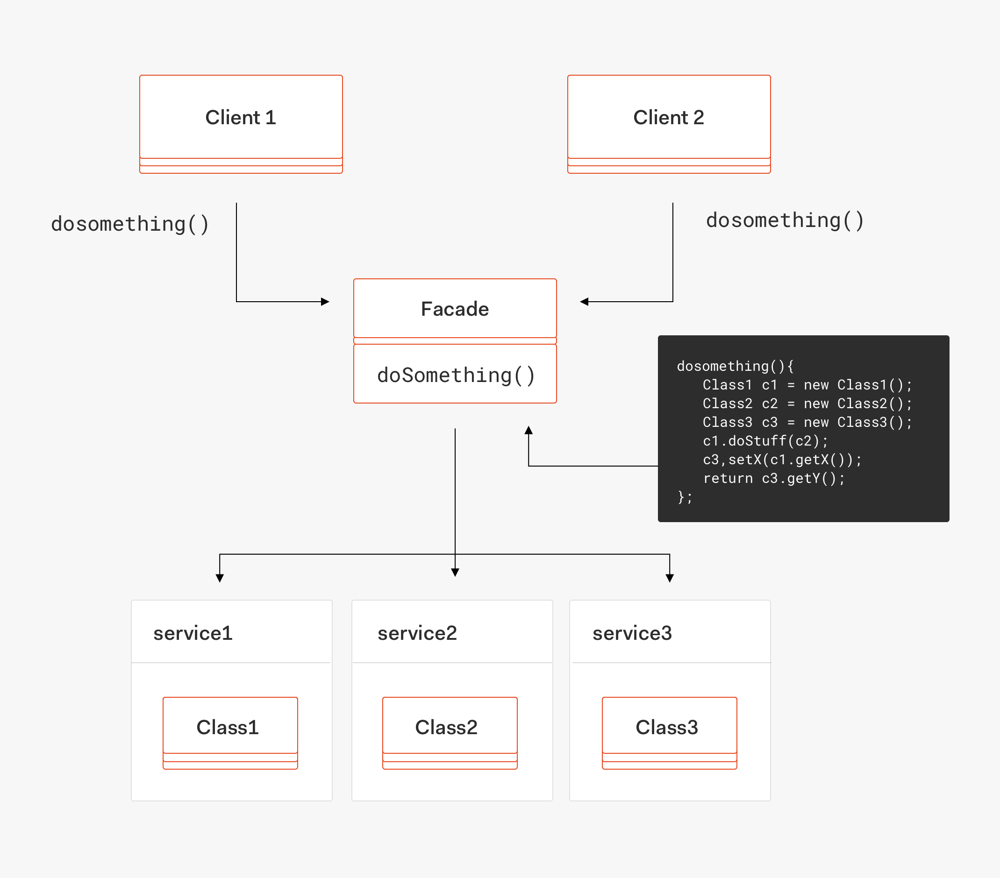

# Angular Clean Code


## Table of Content

- [Introduction](#Introduction)
- [Repo](#Repo)
- [Configuration](#Configuration)
  - [Configuring tsconfig.json](#Configuring-tsconfig.json)
  - [Configuring TSLint](#Configuring-TSLint)
  - [Configuring Prettier](#Configuring-Prettier)
- [Angular Architecture](#angular-architecture)
  - [Project structure](#project-structure)
    - [AppModule](#AppModule)
    - [CoreModule](#CoreModule)
    - [SharedModule](#SharedModule)
  - [Data flow architecture](#data-flow-architecture)
    - [Change Detection](#Change-Detection)
  - [State management](#state-management)
- [Angular Features](#Angular-Features)
  - [Directive](#Directive)
  - [Pipe](#Pipe)
- [Angular Forms](#angular-forms)
  - [Basic setup](#Basic-setup)
  - [Custom FormGroup Validator](#Custom-FormGroup-Validator)
  - [Custom FormControl Validator](#Custom-FormControl-Validator)
- [Angular Routing](#angular-routing)
  - [Custom RouteReuseStrategy](#Custom-RouteReuseStrategy)
- [Unit testing](#Unit-testing)
  - [Karma configuration for CI/CD (bamboo example)](#Unit-testing)
- [JWT Token Interceptor](#JWT-Token-Interceptor)
- [Unsubscribing with takeUntil](#Unsubscribing-with-takeUntil)

## Introduction

In order to maintain high quality of delivery and prevent technical debt from being created, we had to agree to a series of guidelines and good practices of how to plan, structure and write applications in Angular


## Repo

Repo with Code: https://github.com/lubkoKuzenko/ng10-start


## Configuration

**Resources**

- ["TypeScript Deep Dive: tsconfig.json"](https://basarat.gitbook.io/typescript/project/compilation-context/tsconfig)

- ["tsconfig.json с комментариями"](https://gist.github.com/lubkoKuzenko/b0dfc526a8be2a00f007542960206260)

- ["TSLint core rules"](https://palantir.github.io/tslint/rules/)

- ["Configuring TSLint"](https://palantir.github.io/tslint/usage/configuration/)

- ["Prettier Options"](https://prettier.io/docs/en/options.html/)

### Configuring tsconfig.json

The presence of a tsconfig.json file in a directory indicates that the directory is the root of a TypeScript project. The tsconfig.json file specifies the root files and the compiler options required to compile the project.

```ts
// tsconfig.json
{
  "compileOnSave": false,
  "compilerOptions": {
    // Basic Options
    "target": "es5",                        // Specify ECMAScript target version: 'ES3' (default), 'ES5', 'ES2015', 'ES2016', 'ES2017', or 'ESNEXT'.
    "module": "commonjs",                  // Specify module code generation: 'commonjs', 'amd', 'system', 'umd' or 'es2015'.
    "lib": [],                             // Specify library files to be included in the compilation:
    "allowJs": true,                       // Allow JavaScript files to be compiled.
    "checkJs": true,                       // Report errors in .js files.
    "jsx": "preserve",                     // Specify JSX code generation: 'preserve', 'react-native', or 'react'.
    "declaration": true,                   // Generates corresponding '.d.ts' file.
    "sourceMap": true,                     // Generates corresponding '.map' file.
    "outFile": "./",                       // Concatenate and emit output to single file.
    "outDir": "./",                        // Redirect output structure to the directory.
    "rootDir": "./",                       // Specify the root directory of input files. Use to control the output directory structure with --outDir.
    "removeComments": true,                // Do not emit comments to output.
    "noEmit": true,                        // Do not emit outputs.
    "importHelpers": true,                 // Import emit helpers from 'tslib'.
    "downlevelIteration": true,            // Provide full support for iterables in 'for-of', spread, and destructuring when targeting 'ES5' or 'ES3'.
    "isolatedModules": true,               // Transpile each file as a separate module (similar to 'ts.transpileModule').
​
    // Strict Type-Checking Options
    "strict": true,                        // Enable all strict type-checking options.
    "noImplicitAny": true,                 // Raise error on expressions and declarations with an implied 'any' type.
    "strictNullChecks": true,              // Enable strict null checks.
    "noImplicitThis": true,                // Raise error on 'this' expressions with an implied 'any' type.
    "alwaysStrict": true,                  // Parse in strict mode and emit "use strict" for each source file.
​
    // Additional Checks
    "noUnusedLocals": true,                // Report errors on unused locals.
    "noUnusedParameters": true,            // Report errors on unused parameters.
    "noImplicitReturns": true,             // Report error when not all code paths in function return a value.
    "noFallthroughCasesInSwitch": true,    // Report errors for fallthrough cases in switch statement.
​
    // Module Resolution Options
    "moduleResolution": "node",            // Specify module resolution strategy: 'node' (Node.js) or 'classic' (TypeScript pre-1.6).
    "baseUrl": "./",                       // Base directory to resolve non-absolute module names.
    "paths": {},                           // A series of entries which re-map imports to lookup locations relative to the 'baseUrl'.
    "rootDirs": [],                        // List of root folders whose combined content represents the structure of the project at runtime.
    "typeRoots": [],                       // List of folders to include type definitions from.
    "types": [],                           // Type declaration files to be included in compilation.
    "allowSyntheticDefaultImports": true,  // Allow default imports from modules with no default export. This does not affect code emit, just typechecking.
​
    // Source Map Options
    "sourceRoot": "./",                    // Specify the location where debugger should locate TypeScript files instead of source locations.
    "mapRoot": "./",                       // Specify the location where debugger should locate map files instead of generated locations.
    "inlineSourceMap": true,               // Emit a single file with source maps instead of having a separate file.
    "inlineSources": true,                 // Emit the source alongside the sourcemaps within a single file; requires '--inlineSourceMap' or '--sourceMap' to be set.
​
    // Experimental Options
    "experimentalDecorators": true,        // Enables experimental support for ES7 decorators.
    "emitDecoratorMetadata": true          // Enables experimental support for emitting type metadata for decorators.
  }
}
```

### Configuring TSLint

tslint.json or tslint.yaml files can have the following fields specified:

- extends?: string | string[]: The name of a built-in configuration preset (see built-in presets below), or a path or array of paths to other configuration files which are extended by this configuration. This value is handled using node module resolution semantics. For example, a value of "tslint-config" would tell TSLint to try and load the main file of a module named “tslint-config” as a configuration file. Specific files inside node modules can also be specified, eg. "tslint-config/path/to/submodule". Relative paths to JSON files or JS modules are also supported, e.g. "./tslint-config".

- rulesDirectory?: string | string[]: A path to a directory or an array of paths to directories of custom rules. These values are handled using node module resolution semantics, if an index.js is placed in your rules directory. We fallback to use relative or absolute paths, if the module can’t be resolved. If you want to avoid module resolution you can directly use a relative or absolute path (e.g. with ./).

- rules?: { [name: string]: RuleSetting }: A map of rule names to their configuration settings.

  - These rules are applied to .ts and .tsx files.
  - Each rule is associated with an object containing:

    - options?: any: An array of values that are specific to a rule.
    - severity?: "default" | "error" | "warning" | "off": Severity level.
    - Level “error” will cause exit code 2.

  - Legacy: An array may be specified instead of the above object, and is equivalent to setting the rule with the default severity if the first value in the array is true, with configuration parameters in the remainder of the array.

    - "no-empty": [true, "allow-empty-catch"] is strictly equivalent to "no-empty": { "options": ['allow-empty-catch'], "severity": 'default' }

  - Legacy: A boolean value may be specified instead of the above object, and is equivalent to setting no options with default severity.
  - Any rules specified in this block will override those configured in any base configuration being extended.

    Check out the full rules list here.

  - jsRules?: any | boolean: Same format as rules or explicit true to copy all rule configurations for JS-compatible rules from rules. These rules are applied to .js and .jsx files.

  - defaultSeverity?: "error" | "warning" | "off": The severity level that is applied to rules in this config file as well as rules in any inherited config files which have their severity set to “default”. If undefined, “error” is used as the defaultSeverity.

  - linterOptions?: { exclude?: string[] }:
    exclude: string[]: An array of globs. Any file matching these globs will not be linted. All exclude patterns are relative to the configuration file they were specified in.

  - format: string: Default lint formatter

tslint.json configuration files may have JavaScript-style // single-line and /_ multi-line _/ comments in them (even though this is technically invalid JSON)

An example tslint.json file might look like this:

```json
// tslint.json
{
  "extends": [
    "tslint:recommended",
    "tslint-sonarts",
    "tslint-angular",
    "tslint-config-prettier"
  ],
  "rulesDirectory": ["node_modules/codelyzer"],
  "jsRules": {},
  "rules": {
    "curly": [true, "ignore-same-line"],
    "max-line-length": [true, 120],
    "no-console": false,
    "no-commented-code": false,
    "object-literal-sort-keys": false,
    "object-literal-key-quotes": false,
    "ordered-imports": false,
    "interface-name": false,
    "max-classes-per-file": false,
    "cyclomatic-complexity": [true, 15],
    "member-ordering": false,
    "no-invalid-await": false,
    "no-duplicate-string": [true, 7],
    "variable-name": [
      true,
      "check-format",
      "allow-leading-underscore",
      "allow-pascal-case",
      "allow-snake-case",
      "ban-keywords"
    ],
    "template-banana-in-box": true,
    "template-no-negated-async": true
  },
  "linterOptions": {
    "exclude": []
  }
}
```

### Configuring Prettier

```ts
// .prettierrc
printWidth: 120
tabWidth: 2
semi: true
singleQuote: false
trailingComma: all # other options `es5` or `all`
bracketSpacing: true
arrowParens: always # other option "always"
htmlWhitespaceSensitivity: 'ignore'
```


## Angular Architecture

**Resources**

- ["Angular Application Architecture"](https://bulldogjob.pl/articles/539-scalable-angular-application-architecture)
- ["Change Detection in Angular"](https://vsavkin.com/change-detection-in-angular-2-4f216b855d4c)
- ["Everything you need to know about change detection in Angular"](https://blog.angularindepth.com/everything-you-need-to-know-about-change-detection-in-angular-8006c51d206f)

### What is a scalable architecture?

First of all, what does it mean that GUI application is scalable? GUI always runs as a single, separate application for every user, so there is no "high number of users" challenge that is typical for backend applications. Instead, GUI has to deal with the following scalability factors: increasing size of data loaded to the application, growing complexity and size of the project, usually followed by longer loading times.

There is also a part of the problem that is not visible from the outside, namely how an application scales from the programmer’s point of view. An application with bad, or not scalable architecture, tends to be very hard to develop after some time. Increasing complexity, technical debt and simply code smell, has a direct impact on project estimates, costs and the quality of the overall solution.

Good architecture does not guarantee that above problems will not occur in your application, however, it gives the development team a powerful tool to reduce and even eliminate most of the issues that they might encounter.

In short, well designed architecture should work equally good for small and big applications, should provide very good user experience regardless of the application’s size and amount of processed data. Additionally, it should provide a set of clear and easy to follow rules for developers in order to sustain the quality of the project. And finally, it should be simple and preferably based on widely accepted design patterns. We want to keep the learning curve of our applications as small as possible.

### Project structure

Application modules are clearly visible in the file tree, as separate directories. Every module directory contains all files (code, styles, templates etc.) that are related to a given module. A very important element of this approach is isolation of modules. Simply speaking, it means that every module is self-contained and does not refer to files from different modules, so, theoretically, you can delete one of them from the application, and the rest will work without any problems.



Obviously, it’s not possible to strictly follow this rule in the real world. At least some services and components have to be reused across the whole application. Therefore, some parts of application functionality are stored in "Core" and "Shared" modules. Now our application structure looks like this:



As you can see, there are now three main modules in the project:

#### AppModule

The bootstrapping module, responsible for launching the application and combining other modules together

```ts
import { NgModule } from "@angular/core";

import { CoreModule } from "./core";
import { SharedModule } from "./shared";

import { AppRoutingModule } from "./app-routing.module";
import { AppComponent } from "./app.component";

import { DashboardModule } from "./dashboard/dashboard.module";

@NgModule({
  declarations: [AppComponent],
  imports: [
    CoreModule,
    SharedModule,

    // features
    DashboardModule,

    // app
    AppRoutingModule
  ],
  providers: [],
  bootstrap: [AppComponent]
})
export class AppModule {}
```

#### CoreModule

Core functionalities, mostly global services, that will be used in the whole application globally. They should not be imported by other application modules

```ts
import { NgModule, Optional, SkipSelf, ErrorHandler } from "@angular/core";
import { CommonModule } from "@angular/common";
import { HttpClientModule, HTTP_INTERCEPTORS } from "@angular/common/http";
import { TokenInterceptor } from "./http-interceptors/http-token.interceptor";
import { AppErrorInterceptor } from "./http-interceptors/http-error.interseptor";

import { AppInitService } from "./app-init.service";
export function initializerFactory(appConfig: AppInitService) {
  return (): Promise<any> => {
    return appConfig.load();
  };
}

@NgModule({
  imports: [CommonModule, HttpClientModule],
  providers: [
    {
      provide: HTTP_INTERCEPTORS,
      useClass: TokenInterceptor,
      multi: true
    },
    {
      provide: APP_INITIALIZER,
      useFactory: initializerFactory,
      deps: [AppInitService],
      multi: true
    },
    {
      provide: ErrorHandler,
      useClass: AppErrorInterceptor
    }
  ],
  exports: [HttpClientModule]
})
export class CoreModule {
  constructor(
    @Optional()
    @SkipSelf()
    parentModule: CoreModule
  ) {
    if (parentModule) {
      throw new Error("CoreModule is already loaded. Import only in AppModule");
    }
  }
}
```

#### SharedModule

Usually a set of components or services that will be reused in other application modules, not applied globally. They can be imported by feature modules.

Structure of SHARED module:

shared

- modules
  - primeng.module.ts
  - material.module.ts
  - \*.module.ts
- directives
  - \*.directive.ts
  - directives.module
- pipes
  - \*.pipe.ts
  - pipes.module
- components
  - \*.component.ts
  - components.module

```ts
import { NgModule } from "@angular/core";
import { CommonModule } from "@angular/common";
import { FormsModule, ReactiveFormsModule } from "@angular/forms";
import { BrowserModule } from "@angular/platform-browser";
import { BrowserAnimationsModule } from "@angular/platform-browser/animations";

import { SharedDirectivesModule } from "./directives/directives.module";
import { SharedPipesModule } from "./pipes/pipes.module";
import { SharedComponentsModule } from "./components/components.module";

const SHARED_MODULES = [
  CommonModule,
  FormsModule,
  ReactiveFormsModule,

  SharedDirectivesModule,
  SharedPipesModule,
  SharedComponentsModule
];

@NgModule({
  providers: [],
  declarations: [],
  imports: [...SHARED_MODULES],
  exports: [...SHARED_MODULES]
})
export class SharedModule {}
```

directives.module.ts, pipes.module.ts, components.module.ts has the same structure:

```ts
// components.module.ts
import { CommonModule } from "@angular/common";
import { NgModule, Type } from "@angular/core";
import { ReactiveFormsModule } from "@angular/forms";

export const SHARED_COMPONENTS: Array<Type<any>> = [];

@NgModule({
  imports: [CommonModule, ReactiveFormsModule],
  declarations: [...SHARED_COMPONENTS],
  exports: [...SHARED_COMPONENTS]
})
export class SharedComponentsModule {}
```

All remaining modules (so-called feature modules) should be isolated and independent. Such a structure not only allows for clear concerns separation, but is also a convenient starting point for implementing lazy loading functionality, another crucial step in preparing a scalable application architecture.

### Data flow architecture

Let's start with data flow. Angular 2+, unlike its predecessor, prefers a one way data flow. This kind of approach is much easier to maintain and follow than two-way data binding. It is more obvious what is the source of data in a given module and how the change is propagated through the system. In Angular, data flows from top to bottom. From the parent component to the child component and from the component to the template.

Still, it's a good idea to add some additional set of rules over the basic data flow principles.

In our application we've introduced the idea of "smart" and "dummy" components. The smart components are also called "Containers". The idea behind this division is to clearly define the parts of the application that contain some logic, communicate with services and cause side effects (like service calls, state updates etc.). Every such action is implemented only in Containers. On the contrary, "stupid" components have very little or no logic at all. All the data they need is passed by @Input parameters. If a component wants to communicate with the outside word, it has to emit an event (via @Output attribute).



Such architectural approach is intended to keep the number of Containers as small as possible. The more components in the application are "dummy", the simpler is the data flow and the easier it is to work with it. Deciding which component should take the role of a Container and which should be just a plain component is not a trivial task and needs to be resolved per particular case. However, usually the first step we take is assuming that a main screen component should be the smart one, as in the example below, when the container is marked with blue color and simple components are gray.

Such an approach to architecture is not only about readability of code and organized data flow. Dummy component are much easier to test. Their state is entirely induced by the Input they are provided with, they cause no side effect and the result of any component action is visible as a proper event being fired.

What is more, such behavior nicely corresponds with performance optimization of Angular’s change detection process. The change detection strategy for dummy components can be set to "onPush" which will trigger the change detection process for the component only when the input properties have been modified. It's an easy and very efficient method of optimizing Angular applications.

### Presentational Components

- are purely user interface and concerned with how things look.
- are not aware about the business logic, or services.
- receive data via @Inputs, and emit events via @Output.

### Container Components

- contain all the business logic.
- pass the data to the Presentational Components, and handle @Output events raised by them.
- have no UI logic.
- do have dependencies on other parts of your app, like services, or your state store.

#### Change Detection

On each asynchronous event, Angular performs change detection over the entire component tree. Although the code which detects for changes is optimized for [inline-caching](http://mrale.ph/blog/2012/06/03/explaining-js-vms-in-js-inline-caches.html), this still can be a heavy computation in complex applications. A way to improve the performance of the change detection is to not perform it for subtrees which are not supposed to be changed based on the recent actions.

#### `ChangeDetectionStrategy.OnPush`

The `OnPush` change detection strategy allows us to disable the change detection mechanism for subtrees of the component tree. By setting the change detection strategy to any component to the value `ChangeDetectionStrategy.OnPush` will make the change detection perform **only** when the component has received different inputs. Angular will consider inputs as different when it compares them with the previous inputs by reference, and the result of the reference check is `false`. In combination with [immutable data structures](https://facebook.github.io/immutable-js/), `OnPush` can bring great performance implications for such "pure" components.

### State management

#### Facade Design Pattern

Facade discusses encapsulating a complex subsystem within a single interface object. This reduces the learning curve necessary to successfully leverage the subsystem. It also promotes decoupling the subsystem from its potentially many clients.
The Facade object should be a fairly simple advocate or facilitator. It should not become an all-knowing oracle or “god” object.
Here is the good read for Facade design pattern in details



I would recommend following steps to build Angular services using Facade pattern:

- Define all your Angular services as per your business requirement and/or keep adding more as needed.
- Create a service called “FacadeService” (feel free to use any other name here)
- Create a Module and provide all Angular services

```ts
// user.service.ts
import { Injectable } from "@angular/core";

@Injectable()
export class UserService {
  constructor() {}

  getUsers() {
    return [{ name: "test" }];
  }
}
```

```ts
// facade.service.ts
@Injectable()
export class FacadeService {
  // users
  public users$ = new BehaviorSubject<User[]>([]);

  constructor(public userService: UserService) {}

  public getUsers() {
    return this.users$.next(this.userService.getUsers());
  }
}
```

```ts
// ./containers/users.component.ts
@Component({
  templateUrl: "./users.html",
  styleUrls: ["./users.scss"]
})
export class UsersComponent implements OnInit {
  public users$ = this.facadeService.users$;

  constructor(public facadeService: FacadeService) {}

  public ngOnInit(): void {
    this.facadeService.getUsers();
  }
}
```

```html
<!-- ./containers/users.component.html  -->
{{ users$ | async | json }}
```

```ts
// feature.module.ts
@NgModule({
  imports: [CommonModule],
  declarations: [],
  providers: [UserService, FacadeService]
})
export class FeatureModule {}
```


## Angular Features

### Directive

Directive should be stored in Directives folder of Shared Module.

```ts
// underline.directive.ts
import {
  Directive,
  ElementRef,
  HostListener,
  HostBinding,
  Renderer2
} from "@angular/core";

// Annotation section
@Directive({ selector: "[bbUnderline]" })

/*
 *element-name: select by element name.
 *.class: select by class name.
 *[attribute]: select by attribute name.
 *[attribute=value]: select by attribute name and value.
 *:not(sub_selector): select only if the element does not match the sub_selector.
 *selector1, selector2: select if either selector1 or selector2 matches.
 */
export class UnderlineDirective {
  // @Input() my: boolean;
  constructor(private el: ElementRef, private renderer: Renderer2) {}

  // HostBinding - will bind property to host element, If a binding changes, HostBinding will update the host element.
  // @HostBinding('style.backgroundColor')
  // color = 'yellow';

  // HostListener - will listen to the event emitted by host element, declared with @HostListener.
  @HostListener("mouseenter")
  onMouseEnter() {
    this.hover(true);
  }

  @HostListener("mouseleave")
  onMouseLeave() {
    this.hover(false);
  }

  hover(shouldUnderline: boolean) {
    if (shouldUnderline) {
      this.renderer.setStyle(
        this.el.nativeElement,
        "text-decoration",
        "underline"
      );
    } else {
      this.renderer.setStyle(this.el.nativeElement, "text-decoration", "none");
    }
  }
}
```

### Pipe

Pipe should be stored in Pipes folder of Shared Module.

```ts
// reverse.pipe.ts
// how to use {{text | reverseStr}}
import { Pipe, PipeTransform } from "@angular/core";

@Pipe({
  name: "reverseStr"
})
export class ReverseStrPipe implements PipeTransform {
  transform(value: string): string {
    let newStr = "";

    for (let i = value.length - 1; i >= 0; i--) {
      newStr += value.charAt(i);
    }

    return newStr;
  }
}
```


## Angular Forms

**Resources**

- ["Custom Form Validators"](https://codecraft.tv/courses/angular/advanced-topics/basic-custom-validators/)
- ["Custom Form Validation in Angular"](https://www.digitalocean.com/community/tutorials/angular-custom-validation/)

- ["Reactive FormGroup validation with AbstractControl in Angular"](https://ultimatecourses.com/blog/reactive-formgroup-validation-angular-2/)

### Basic setup

```ts
import {
  ChangeDetectionStrategy,
  Component,
  Input,
  OnInit
} from "@angular/core";
import { FormControl, FormGroup, Validators } from "@angular/forms";

@Component({
  selector: "lib-form",
  templateUrl: "./form.component.html",
  styleUrls: ["./form.component.scss"],
  changeDetection: ChangeDetectionStrategy.OnPush
})
export class FormGeneralComponent implements OnInit {
  public form = new FormGroup({
    name: new FormControl("", [Validators.required]),
    description: new FormControl(undefined, [Validators.required]),
    status: new FormControl(1, [Validators.required])
  });

  get controls() {
    return this.form.controls;
  }

  public ngOnInit() {
    this.initializeFormValues();
  }

  // reset form
  public reset() {
    this.form.reset();
  }

  // populate form values
  public initializeFormValues() {
    this.form.patchValue({
      name: "name",
      description: "description",
      status: 2
    });
  }

  // GET form values
  public onSubmit() {
    this.form.getRawValue();
  }
}
```

### Custom FormGroup Validator

```ts

// form.component.ts

import { atLeastOneRequiredValidator } from "./validators.ts";

public form = new FormGroup({
  programName: new FormGroup(
    {
        program: new FormControl(""),
        switch: new FormControl(""),
        intervention: new FormControl(""),
    },
    { validators: atLeastOneRequiredValidator() },
  ),
});
```

```ts
// validators.ts
import { ValidatorFn, FormGroup, ValidationErrors } from "@angular/forms";

export const atLeastOneRequiredValidator = (): ValidatorFn => {
  return (group: FormGroup): ValidationErrors => {
    const control1 = group.controls["program"];
    const control2 = group.controls["switch"];
    const control3 = group.controls["intervention"];

    if (
      control1.value === "" &&
      control2.value === "" &&
      control3.value === ""
    ) {
      return { empty: true };
    }

    return null;
  };
};
```

### Custom FormControl Validator

```ts
// form.component.ts
import { ValidatePhone } from "./validators.ts";

public form = new FormGroup({
  phone: ['', [ValidatePhone]]
});
```

```ts
// validators.ts
export const ValidatePhone = (): ValidatorFn => {
  return (control: AbstractControl): ValidationErrors => {
    if (control.value && control.value.length != 10) {
      return { phoneNumberInvalid: true };
    }
    return null;
  };
};
```


## Angular Routing

**Resources**

- ["Angular Component Reuse Strategy"](https://medium.com/@juliapassynkova/angular-2-component-reuse-strategy-9f3ddfab23f5/)

### Custom RouteReuseStrategy

RouteReuseStrategy decides on whether the router should store the current route when deactivating it or whether the router should restore it when the user re-activates it.

```ts
// app.module.ts
import { RouteReuseStrategy } from "@angular/router";
import { CustomReuseStrategy } from "./router-reuse.strategy.ts";

@NgModule({
  declarations: [],
  imports: [],
  providers: [{ provide: RouteReuseStrategy, useClass: CustomReuseStrategy }],
  bootstrap: [AppComponent]
})
export class AppModule {}
```

````ts
// router-reuse.strategy.ts
import { Injectable } from "@angular/core";
import {
  RouteReuseStrategy,
  ActivatedRouteSnapshot,
  DetachedRouteHandle
} from "@angular/router";
/**
 * Based on Angular `DefaultRouteReuseStrategy`.
 * Reuses routes as long as their route config is the same OR until future route data has pattribute `noReuse: true`
 *
 * @example ```json
 *   {
 *       path: "overview",
 *       component: OverviewComponent,
 *        data: {
 *            noReuse: true,
 *        },
 *    },
 * ```
 */
@Injectable()
export class CustomReuseStrategy implements RouteReuseStrategy {
  public shouldDetach(route: ActivatedRouteSnapshot): boolean {
    return false;
  }

  public store(
    route: ActivatedRouteSnapshot,
    detachedTree: DetachedRouteHandle
  ): void {}

  public shouldAttach(route: ActivatedRouteSnapshot): boolean {
    return false;
  }

  public retrieve(route: ActivatedRouteSnapshot): DetachedRouteHandle | null {
    return null;
  }

  public shouldReuseRoute(
    future: ActivatedRouteSnapshot,
    curr: ActivatedRouteSnapshot
  ): boolean {
    if (future.data && Boolean(future.data.noReuse)) {
      return !future.data.noReuse;
    }
    return future.routeConfig === curr.routeConfig;
  }
}
````


## Unit testing

### Karma configuration for CI/CD (bamboo example)

```js
module.exports = function(config) {
  config.set({
    basePath: "",
    frameworks: ["jasmine", "@angular-devkit/build-angular"],
    plugins: [
      require("karma-jasmine"),
      require("karma-chrome-launcher"),
      require("karma-bamboo-reporter"),
      require("karma-jasmine-html-reporter"),
      require("karma-coverage-istanbul-reporter"),
      require("@angular-devkit/build-angular/plugins/karma")
    ],
    client: {
      clearContext: false // leave Jasmine Spec Runner output visible in browser
    },
    coverageIstanbulReporter: {
      dir: require("path").join(__dirname, "../../coverage/"),
      reports: ["html", "lcovonly", "clover"],
      fixWebpackSourcePaths: true,
      "report-config": {
        html: {
          subdir: "html"
        },
        clover: {
          subdir: "clover"
        }
      }
    },
    bambooReporter: {
      filename: "coverage/mocha.json"
    },
    reporters: ["progress", "kjhtml", "bamboo"],
    port: 9876,
    colors: true,
    logLevel: config.LOG_INFO,
    autoWatch: true,
    // browsers: ["Chrome"], // enable this line locally for testing and debugging
    browsers: ["ChromeHeadlessNoSandbox"],
    customLaunchers: {
      ChromeHeadlessNoSandbox: {
        base: "ChromeHeadless",
        flags: ["--no-sandbox"],
        options: {
          viewportSize: {
            width: 1280,
            height: 1024
          }
        }
      }
    },
    singleRun: false,
    restartOnFileChange: true
  });
};
```


## JWT Token Interceptor

```ts
import { Injectable, Injector, ErrorHandler } from "@angular/core";
import {
  HttpEvent,
  HttpInterceptor,
  HttpHandler,
  HttpResponse,
  HttpRequest,
  HttpErrorResponse
} from "@angular/common/http";
import { Observable, of } from "rxjs";
import { tap } from "rxjs/operators";

@Injectable()
export class TokenInterceptor implements HttpInterceptor {
  constructor() {}

  intercept(
    request: HttpRequest<any>,
    next: HttpHandler
  ): Observable<HttpEvent<any>> {
    request = request.clone({
      setHeaders: {
        Authorization: `Bearer token`
      }
    });

    return next.handle(request).pipe(
      tap(
        (event: HttpEvent<any>) => {
          this.onSuccess(event);
        },
        (error: any) => {
          this.onError(error);
        }
      )
    );
  }

  onSuccess(event) {
    if (event instanceof HttpResponse) {
      // Intercepting HTTP responses
    }
  }

  onError(error) {
    if (error instanceof HttpErrorResponse) {
      console.log("%cHttp error message: " + error.message);
    }
  }
}
```

## Unsubscribing with takeUntil

The solution is to compose our subscriptions with the takeUntil operator and use a subject that emits a truthy value in the ngOnDestroy lifecycle hook.

The following snippet does the exact same thing, but this time we unsubscribe declaratively. You’ll notice that an added benefit is that we don’t need to keep references to our subscriptions anymore:

```ts

import { Observable } from 'rxjs/Observable';
import { Subject } from 'rxjs/Subject';
import 'rxjs/add/observable/interval';
import 'rxjs/add/operator/takeUntil';

@Component({ ... })
export class AppComponent implements OnInit, OnDestroy {
  destroy$: Subject<boolean> = new Subject<boolean>();

  constructor() {
    Observable
    .interval(250)
    .takeUntil(this.destroy$)
    .subscribe(val => {
      console.log('Current value:', val);
    });
  }

  ngOnDestroy() {
    this.destroy$.next(true);
    // Now let's also unsubscribe from the subject itself:
    this.destroy$.unsubscribe();
  }
```

Note that Using an operator like takeUntil instead of manually unsubscribing will also complete the observable, triggering any completion event on the observable
