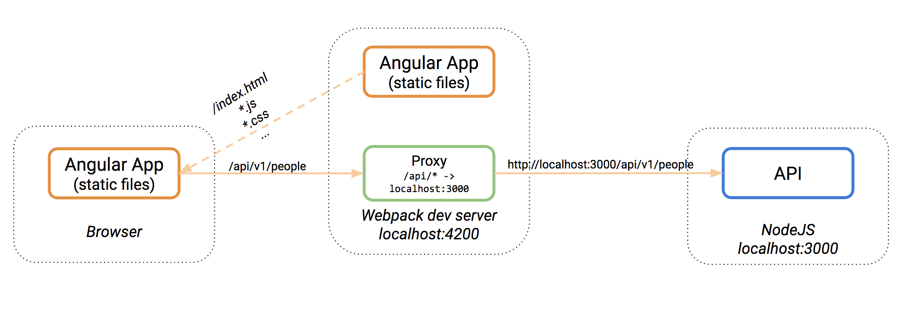
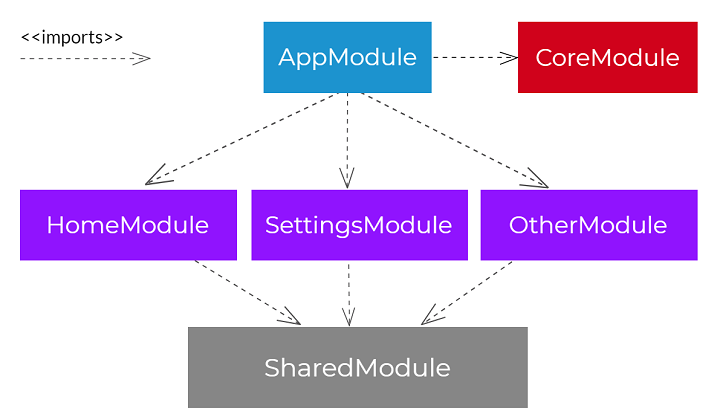
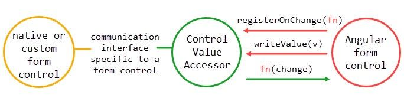
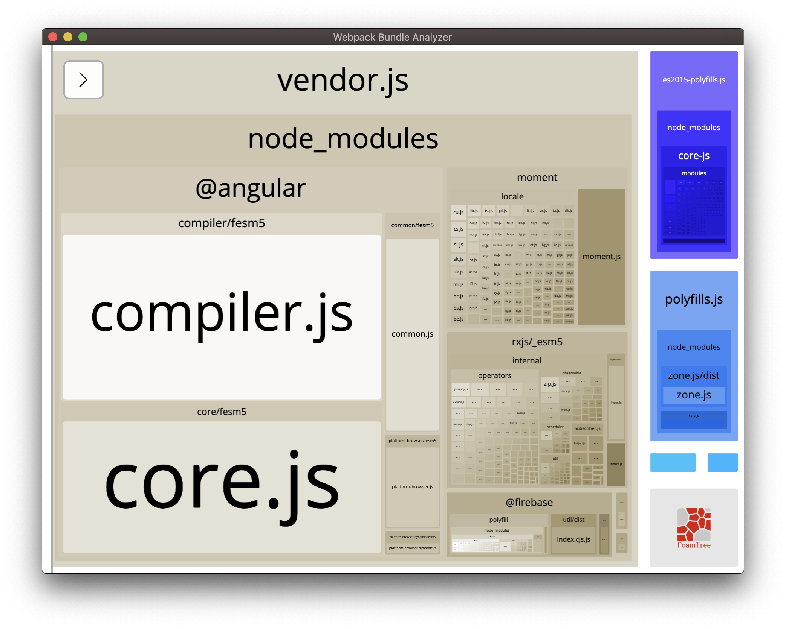

# Angular Clean Code


## Table of Content

- [Introduction](#Introduction)
- [Repo](#Repo)
- [Configuration](#Configuration)
  - [Configuring tsconfig.json](#Configuring-tsconfigjson)
  - [Configuring Angular ESLint](#Configuring-Angular-ESLint)
  - [Configuring HTMLHint](#Configuring-HTMLHint)
  - [Configuring stylelint](#Configuring-stylelint)
  - [Configuring Prettier](#Configuring-Prettier)
  - [Configuring Proxy for API Calls](#configuring-proxy-for-api-calls)
  - [Configuring Karma for CI/CD (bamboo example)](#karma-configuration-for-cicd-bamboo-example)
  - [Configuring Karma for CI/CD (azure example)](#karma-configuration-for-cicd-azure-example)
- [Angular Architecture](#angular-architecture)
  - [Project structure](#project-structure)
    - [AppModule](#AppModule)
    - [CoreModule](#CoreModule)
    - [SharedModule](#SharedModule)
    - [The Feature Modules](#The-Feature-Modules)
      - [Container Components](#Container-Components)
      - [Presentational Components](#Presentational-Components)
      - [Page Components](#Page-Components)
  - [Data flow architecture](#data-flow-architecture)
  - [Change Detection](#Change-Detection)
  - [State management](#state-management)
- [Angular Features](#Angular-Features)
  - [Directive](#Directive)
  - [Pipe](#Pipe)
- [Angular Forms](#angular-forms)
  - [Basic setup](#Basic-setup)
  - [Nested Forms](#Nested-Forms)
  - [Dynamic Forms](#Dynamic-Forms)
  - [Custom FormGroup Validator](#Custom-FormGroup-Validator)
  - [Custom FormControl Validator](#Custom-FormControl-Validator)
  - [ControlValueAccessor](#ControlValueAccessor)
  - [Testing Forms](#Testing-Forms)
- [Angular Routing](#angular-routing)
  - [Custom RouteReuseStrategy](#Custom-RouteReuseStrategy)
- [Unit testing](#Unit-testing)
  - [How to test OnPush components](#how-to-test-onpush-components)
- [Error Handling](#Error-Handling)
  - [Errors, Exceptions & CallStack](#errors-exceptions--callstack)
  - [Global Error Handler](#Global-Error-Handler)
- [JWT Token Interceptor](#JWT-Token-Interceptor)
- [Angular Dynamic Components](#Angular-Dynamic-Components)
- [Unsubscribe from Observables](#Unsubscribe-from-Observables)
- [Containerizing Angular using Docker](#Containerizing-Angular-using-Docker)
- [Performance](#Performance)
  - [Webpack Bundle Analyzer](#Webpack-Bundle-Analyzer)

## Introduction

In order to maintain high quality of delivery and prevent technical debt from being created, we had to agree to a series of guidelines and good practices of how to plan, structure and write applications in Angular


## Repo

Repo with Code: https://github.com/lubkoKuzenko/ng-start


## Configuration

**Resources**

- ["TypeScript Deep Dive: tsconfig.json"](https://basarat.gitbook.io/typescript/project/compilation-context/tsconfig)

- ["tsconfig.json с комментариями"](https://gist.github.com/lubkoKuzenko/b0dfc526a8be2a00f007542960206260)

- ["Angular ESLint"](https://github.com/angular-eslint/angular-eslint#migrating-from-codelyzer-and-tslint/)

- ["Configuring HTMLHint"](https://github.com/htmlhint/HTMLHint/)

- ["List of HTMLHint rules"](https://github.com/htmlhint/HTMLHint/blob/master/docs/user-guide/list-rules.md/)

- ["Configuring stylelint"](https://github.com/stylelint/stylelint/)

- ["List of stylelint rules"](https://github.com/stylelint/stylelint/blob/master/docs/user-guide/rules/list.md/)

- ["Prettier Options"](https://prettier.io/docs/en/options.html/)

- ["Configure a proxy for your API calls with Angular CLI"](https://juristr.com/blog/2016/11/configure-proxy-api-angular-cli/)

- ["Setup a Proxy for API Calls for Your Angular CLI App"](https://medium.com/better-programming/setup-a-proxy-for-api-calls-for-your-angular-cli-app-6566c02a8c4d/)

### Configuring tsconfig.json

The presence of a tsconfig.json file in a directory indicates that the directory is the root of a TypeScript project. The tsconfig.json file specifies the root files and the compiler options required to compile the project.

```ts
// tsconfig.json
{
  "compileOnSave": false,
  "compilerOptions": {
    // Basic Options
    "target": "es5",                        // Specify ECMAScript target version: 'ES3' (default), 'ES5', 'ES2015', 'ES2016', 'ES2017', or 'ESNEXT'.
    "module": "commonjs",                  // Specify module code generation: 'commonjs', 'amd', 'system', 'umd' or 'es2015'.
    "lib": [],                             // Specify library files to be included in the compilation:
    "allowJs": true,                       // Allow JavaScript files to be compiled.
    "checkJs": true,                       // Report errors in .js files.
    "jsx": "preserve",                     // Specify JSX code generation: 'preserve', 'react-native', or 'react'.
    "declaration": true,                   // Generates corresponding '.d.ts' file.
    "sourceMap": true,                     // Generates corresponding '.map' file.
    "outFile": "./",                       // Concatenate and emit output to single file.
    "outDir": "./",                        // Redirect output structure to the directory.
    "rootDir": "./",                       // Specify the root directory of input files. Use to control the output directory structure with --outDir.
    "removeComments": true,                // Do not emit comments to output.
    "noEmit": true,                        // Do not emit outputs.
    "importHelpers": true,                 // Import emit helpers from 'tslib'.
    "downlevelIteration": true,            // Provide full support for iterables in 'for-of', spread, and destructuring when targeting 'ES5' or 'ES3'.
    "isolatedModules": true,               // Transpile each file as a separate module (similar to 'ts.transpileModule').
​
    // Strict Type-Checking Options
    "strict": true,                        // Enable all strict type-checking options.
    "noImplicitAny": true,                 // Raise error on expressions and declarations with an implied 'any' type.
    "strictNullChecks": true,              // Enable strict null checks.
    "noImplicitThis": true,                // Raise error on 'this' expressions with an implied 'any' type.
    "alwaysStrict": true,                  // Parse in strict mode and emit "use strict" for each source file.
​
    // Additional Checks
    "noUnusedLocals": true,                // Report errors on unused locals.
    "noUnusedParameters": true,            // Report errors on unused parameters.
    "noImplicitReturns": true,             // Report error when not all code paths in function return a value.
    "noFallthroughCasesInSwitch": true,    // Report errors for fallthrough cases in switch statement.
​
    // Module Resolution Options
    "moduleResolution": "node",            // Specify module resolution strategy: 'node' (Node.js) or 'classic' (TypeScript pre-1.6).
    "baseUrl": "./",                       // Base directory to resolve non-absolute module names.
    "paths": {},                           // A series of entries which re-map imports to lookup locations relative to the 'baseUrl'.
    "rootDirs": [],                        // List of root folders whose combined content represents the structure of the project at runtime.
    "typeRoots": [],                       // List of folders to include type definitions from.
    "types": [],                           // Type declaration files to be included in compilation.
    "allowSyntheticDefaultImports": true,  // Allow default imports from modules with no default export. This does not affect code emit, just typechecking.
​
    // Source Map Options
    "sourceRoot": "./",                    // Specify the location where debugger should locate TypeScript files instead of source locations.
    "mapRoot": "./",                       // Specify the location where debugger should locate map files instead of generated locations.
    "inlineSourceMap": true,               // Emit a single file with source maps instead of having a separate file.
    "inlineSources": true,                 // Emit the source alongside the sourcemaps within a single file; requires '--inlineSourceMap' or '--sourceMap' to be set.
​
    // Experimental Options
    "experimentalDecorators": true,        // Enables experimental support for ES7 decorators.
    "emitDecoratorMetadata": true          // Enables experimental support for emitting type metadata for decorators.
  }
}
```

### Configuring Angular ESLint

Create file `.eslintrc` in root folder
```ts
{
  "env": {
    "browser": true,
    "es6": true,
    "node": true
  },
  "extends": ["prettier", "prettier/@typescript-eslint"],
  "parser": "@typescript-eslint/parser",
  "parserOptions": {
    "project": "tsconfig.json",
    "sourceType": "module"
  },
  "plugins": [
    "eslint-plugin-import",
    "@angular-eslint/eslint-plugin",
    "@typescript-eslint",
    "@typescript-eslint/tslint"
  ],
  "rules": {
    "@angular-eslint/directive-selector": ["error", { "type": "attribute", "prefix": "bb", "style": "camelCase" }],
    "@angular-eslint/component-selector": ["error", { "type": "element", "prefix": "bb", "style": "kebab-case" }],
    "@angular-eslint/component-class-suffix": "error",
    "@angular-eslint/directive-class-suffix": "error",
    "@angular-eslint/no-input-rename": "error",
    "@angular-eslint/no-output-on-prefix": "error",
    "@angular-eslint/no-output-rename": "error",
    "@angular-eslint/use-pipe-transform-interface": "error",
    "@typescript-eslint/consistent-type-definitions": "error",
    "@typescript-eslint/dot-notation": "off",
    "@typescript-eslint/explicit-member-accessibility": [
      "off",
      {
        "accessibility": "explicit"
      }
    ],
    "@typescript-eslint/member-ordering": "error",
    "@typescript-eslint/naming-convention": "error",
    "@typescript-eslint/no-empty-function": "off",
    "@typescript-eslint/no-empty-interface": "error",
    "@typescript-eslint/no-inferrable-types": [
      "error",
      {
        "ignoreParameters": true
      }
    ],
    "@typescript-eslint/no-misused-new": "error",
    "@typescript-eslint/no-non-null-assertion": "error",
    "@typescript-eslint/no-unused-expressions": "error",
    "@typescript-eslint/prefer-function-type": "error",
    "@typescript-eslint/quotes": ["error", "double"],
    "@typescript-eslint/tslint/config": [
      "error",
      {
        "rules": {
          "whitespace": true
        }
      }
    ],
    "@typescript-eslint/unified-signatures": "error",
    "arrow-body-style": "error",
    "constructor-super": "error",
    "eqeqeq": ["error", "smart"],
    "guard-for-in": "error",
    "id-blacklist": "off",
    "id-match": "off",
    "import/no-deprecated": "warn",
    "no-bitwise": "error",
    "no-caller": "error",
    "no-console": [
      "error",
      {
        "allow": [
          "log",
          "dirxml",
          "warn",
          "error",
          "dir",
          "timeLog",
          "assert",
          "clear",
          "count",
          "countReset",
          "group",
          "groupCollapsed",
          "groupEnd",
          "table",
          "Console",
          "markTimeline",
          "profile",
          "profileEnd",
          "timeline",
          "timelineEnd",
          "timeStamp",
          "context"
        ]
      }
    ],
    "no-debugger": "error",
    "no-empty": "off",
    "no-eval": "error",
    "no-fallthrough": "error",
    "no-new-wrappers": "error",
    "no-restricted-imports": [
      "error",
      {
        "paths": ["rxjs/Rx"],
        "patterns": ["rxjs/(?!operators|testing)"]
      }
    ],
    "no-shadow": [
      "error",
      {
        "hoist": "all"
      }
    ],
    "no-throw-literal": "error",
    "no-undef-init": "error",
    "no-underscore-dangle": "off",
    "no-unused-labels": "error",
    "no-var": "error",
    "prefer-const": "error",
    "radix": "error",
    "spaced-comment": [
      "error",
      "always",
      {
        "markers": ["/"]
      }
    ],
    "indent": "off"
  }
}
```

Add command to script section of `package.json`

```ts
 "lint:ts": "eslint --color -c .eslintrc --ext .ts .",
```

### Configuring HTMLHint

1) Install htmlhint

```npm
npm install --save-dev htmlhint
```

2) Create a .htmlhintrc configuration file in the root of your project:

```.htmlhintrc
{
  "attr-value-not-empty": false
}
```

3) Run HTMLHint on, for example, all the HTML files in your project:

```npm 
"lint:html": "npx htmlhint \"src\" --config .htmlhintrc",
```
4) Configure rules based on rules list: https://github.com/htmlhint/HTMLHint/blob/master/docs/user-guide/list-rules.md

### Configuring stylelint

1) Install stylelint

```npm
npm install --save-dev stylelint stylelint-config-standard
```

2) Create a .htmlhintrc configuration file in the root of your project:

```.stylelintrc
{
  "extends": "stylelint-config-standard"
}
```

3) Run HTMLHint on, for example, all the HTML files in your project:

```npm 
 "lint:scss": "npx stylelint \"src/**/*.scss\" --syntax scss",
```
4) Configure rules based on rules list: https://github.com/stylelint/stylelint/blob/master/docs/user-guide/rules/list.md


### Configuring Prettier

```ts
// .prettierrc
printWidth: 120
tabWidth: 2
semi: true
singleQuote: false
trailingComma: all # other options `es5` or `all`
bracketSpacing: true
arrowParens: always # other option "always"
htmlWhitespaceSensitivity: 'ignore'
```

### Configuring Proxy for API Calls

When we develop an Angular app which needs a back end to persist data, the back end is often served on another port of localhost. For example, the URL to the front end Angular app is `http://localhost:4200`, while the URL to the back end server is `http://localhost:3000`. In this case, if we make an HTTP request from the front end app to the back end server, it is a cross-domain request and we need to do some extra work to make it happen

Angular CLI uses `webpack-dev-server` as the development server. The `webpack-dev-server` makes use of the powerful `http-proxy-middleware` package which allows us to send API requests on the same domain when we have a separate API back end development server



1) Create a file called `proxy.conf.json` next to our project’s `package.json`

2) Add the following contents to the newly created `proxy.conf.json` file:

  ```json
  {
    "/folder/sub-folder/*": {
      "target": "http://localhost:1100",
      "secure": false,
      "pathRewrite": {
        "^/folder/sub-folder/": "/new-folder/"
      },
      "changeOrigin": true,
      "logLevel": "debug"
    }
  }
  ```

3) Edit the `package.json` file’s start script to be:
  ```npm 
  "start": "ng serve --proxy-config proxy.conf.json",
  ```
4) Relaunch the `npm start` process to make our changes effective

#### Options: 

`/folder/sub-folder/*` - path says: When I see this path inside my angular app I want to do something with it. The * character indicates that everything that follows the sub-folder will be included.

`target` - "http://localhost:1100" for the path above make target URL the host/source, therefore in the background we will have.

`pathRewrite` - { "^/folder/sub-folder/": "/new-folder/" }, Now let's say that you want to test your app locally, the url http://localhost:1100/folder/sub-folder/ may contain an invalid path: /folder/sub-folder/. You want to change that path to a correct one which is http://localhost:1100/new-folder/, therefore the pathRewrite will become useful. It will exclude the path in the app(left side) and include the newly written one (right side)

`secure` - represents wether we are using http or https. If https is used in the target attribute then set secure attribute to true otherwise set it to false

`changeOrigin` - option is only necessary if your host target is not the current environment, for example: localhost. If you want to change the host to www.something.com which would be the target in the proxy then set the changeOrigin attribute to "true":

`logLevel` - attribute specifies wether the developer wants to display proxying on his terminal/cmd, hence he would use the "debug" value as shown in the image

### Karma configuration for CI/CD (bamboo example)

```js
module.exports = function(config) {
  config.set({
    basePath: "",
    frameworks: ["jasmine", "@angular-devkit/build-angular"],
    plugins: [
      require("karma-jasmine"),
      require("karma-chrome-launcher"),
      require("karma-bamboo-reporter"),
      require("karma-jasmine-html-reporter"),
      require("karma-coverage-istanbul-reporter"),
      require("@angular-devkit/build-angular/plugins/karma")
    ],
    client: {
      clearContext: false // leave Jasmine Spec Runner output visible in browser
    },
    coverageIstanbulReporter: {
      dir: require("path").join(__dirname, "../../coverage/"),
      reports: ["html", "lcovonly", "clover"],
      fixWebpackSourcePaths: true,
      "report-config": {
        html: {
          subdir: "html"
        },
        clover: {
          subdir: "clover"
        }
      }
    },
    bambooReporter: {
      filename: "coverage/mocha.json"
    },
    reporters: ["progress", "kjhtml", "bamboo"],
    port: 9876,
    colors: true,
    logLevel: config.LOG_INFO,
    autoWatch: true,
    // browsers: ["Chrome"], // enable this line locally for testing and debugging
    browsers: ["ChromeHeadlessNoSandbox"],
    customLaunchers: {
      ChromeHeadlessNoSandbox: {
        base: "ChromeHeadless",
        flags: ["--no-sandbox"],
        options: {
          viewportSize: {
            width: 1280,
            height: 1024
          }
        }
      }
    },
    singleRun: false,
    restartOnFileChange: true
  });
};
```

### Configuring Karma for CI/CD (azure example)
```ts
module.exports = function(config) {
  config.set({
    basePath: '',
    frameworks: ['jasmine', '@angular-devkit/build-angular'],
    plugins: [
      require('karma-jasmine'),
      require('karma-chrome-launcher'),
      require('karma-trx-reporter'),
      require('karma-jasmine-html-reporter'),
      require('karma-coverage-istanbul-reporter'),
      require('@angular-devkit/build-angular/plugins/karma'),
      require('karma-spec-reporter')
    ],
    client: {
      clearContext: false // leave Jasmine Spec Runner output visible in browser
    },
    coverageIstanbulReporter: {
      dir: 'test-results/coverage',
      reports: ['html', 'lcovonly', 'text-summary', 'cobertura'],
      fixWebpackSourcePaths: true
    },
    reporters: ['progress', 'kjhtml', 'trx', 'spec', 'coverage-istanbul'],
    port: 9876,
    colors: true,
    logLevel: config.LOG_INFO,
    autoWatch: true,
    browsers: ['Chrome'],
    customLaunchers: {
      ChromeDebugging: {
        base: 'Chrome',
        flags: ['--remote-debugging-port=9222']
      },
      ChromeHeadlessNoSandbox: {
        base: 'Chrome',
        flags: [
          '--no-sandbox',
          '--disable-setuid-sandbox',
          '--headless',
          '--disable-gpu',
          '--remote-debugging-port=9222'
        ]
      }
    },
    singleRun: false,
    trxReporter: {
      outputFile: 'test-results/test-results.trx',
      shortTestName: false
    }
  });
};
```


## Angular Architecture

**Resources**

- ["Angular Application Architecture"](https://bulldogjob.pl/articles/539-scalable-angular-application-architecture)
- ["Change Detection in Angular"](https://vsavkin.com/change-detection-in-angular-2-4f216b855d4c)
- ["Everything you need to know about change detection in Angular"](https://blog.angularindepth.com/everything-you-need-to-know-about-change-detection-in-angular-8006c51d206f)
- ["Angular File Structure and Best Practices"](https://medium.com/@shijin_nath/angular-right-file-structure-and-best-practices-that-help-to-scale-2020-52ce8d967df5)
- ["How to define a highly scalable folder structure for your Angular project"](https://itnext.io/choosing-a-highly-scalable-folder-structure-in-angular-d987de65ec7)
- ["Component Communication in Angular"](https://www.digitalocean.com/community/tutorials/angular-component-communication)
- ["Designing Scalable Angular Apps: Pages, Containers and Views"](https://blog.bitsrc.io/designing-scalable-angular-apps-pages-containers-and-views-ac9cd83afa2d)

### What is a scalable architecture?

First of all, what does it mean that GUI application is scalable? GUI always runs as a single, separate application for every user, so there is no "high number of users" challenge that is typical for backend applications. Instead, GUI has to deal with the following scalability factors: increasing size of data loaded to the application, growing complexity and size of the project, usually followed by longer loading times.

There is also a part of the problem that is not visible from the outside, namely how an application scales from the programmer’s point of view. An application with bad, or not scalable architecture, tends to be very hard to develop after some time. Increasing complexity, technical debt and simply code smell, has a direct impact on project estimates, costs and the quality of the overall solution.

Good architecture does not guarantee that above problems will not occur in your application, however, it gives the development team a powerful tool to reduce and even eliminate most of the issues that they might encounter.

In short, well designed architecture should work equally good for small and big applications, should provide very good user experience regardless of the application’s size and amount of processed data. Additionally, it should provide a set of clear and easy to follow rules for developers in order to sustain the quality of the project. And finally, it should be simple and preferably based on widely accepted design patterns. We want to keep the learning curve of our applications as small as possible.

### Project structure

Application modules are clearly visible in the file tree, as separate directories. Every module directory contains all files (code, styles, templates etc.) that are related to a given module. A very important element of this approach is isolation of modules. Simply speaking, it means that every module is self-contained and does not refer to files from different modules, so, theoretically, you can delete one of them from the application, and the rest will work without any problems.


Obviously, it’s not possible to strictly follow this rule in the real world. At least some services and components have to be reused across the whole application. Therefore, some parts of application functionality are stored in "Core" and "Shared" modules. Now our application structure looks like this:



As you can see, there are now three main modules in the project:

#### AppModule

In Angular, everything is organized in modules, and every application have at least one of them, the app root module. The app module is the entry point of the application, and is the module that Angular uses to bootstrap the application. The setup instructions when creating a new application produces a minimal `AppModule` with a single component. You’ll evolve this module as the application grows.

```ts
import { NgModule } from "@angular/core";

import { CoreModule } from "./core";
import { SharedModule } from "./shared";

import { AppRoutingModule } from "./app-routing.module";
import { AppComponent } from "./app.component";

import { DashboardModule } from "./dashboard/dashboard.module";

@NgModule({
  declarations: [AppComponent],
  imports: [
    CoreModule,
    SharedModule,

    // features
    DashboardModule,

    // app
    AppRoutingModule
  ],
  providers: [],
  bootstrap: [AppComponent]
})
export class AppModule {}
```

#### CoreModule

The `CoreModule` takes on the role of the app root module, but is not the module that gets bootstrapped by Angular at run-time. The common denominator between the files present here is that we only need to load them once, and that is at run-time, which makes them singleton. The module contains root-scoped services, static components like the navbar and footer, interceptors, guard, constants, enums, utils, and universal models. To prevent re-importing the module elsewhere, we should add a module-import-guard in it’s constructor method.

Structure of Core module:

```bash
├── app
|  ├── core
|  |  ├── guards
|  |  |   └── module-import-guard.ts
|  |  ├── interceptor
|  |  |   ├── error-interceptor.ts
|  |  |   └── jwt-interceptor.ts
|  |  ├── services
|  |  |   ├── app-init.service.ts
|  |  |   └── router-reuse.strategy.ts
|  |  └── core.module.ts
|  ├── app-routing.module.ts
|  └── app.module.ts
├── favicon.ico
├── index.html
├── main.ts
├── styles.scss
└── test.ts
```

```ts
import { NgModule, Optional, SkipSelf, ErrorHandler } from "@angular/core";
import { CommonModule } from "@angular/common";
import { HttpClientModule, HTTP_INTERCEPTORS } from "@angular/common/http";
import { TokenInterceptor } from "./interceptor/jwt-interceptor";
import { AppErrorInterceptor } from "./interceptor/error-interceptor";

import { AppInitService } from "./services/app-init.service";
export function initializerFactory(appConfig: AppInitService) {
  return (): Promise<any> => {
    return appConfig.load();
  };
}

@NgModule({
  imports: [CommonModule, HttpClientModule],
  providers: [
    {
      provide: HTTP_INTERCEPTORS,
      useClass: TokenInterceptor,
      multi: true
    },
    {
      provide: APP_INITIALIZER,
      useFactory: initializerFactory,
      deps: [AppInitService],
      multi: true
    },
    {
      provide: ErrorHandler,
      useClass: AppErrorInterceptor
    }
  ],
  exports: [HttpClientModule]
})
export class CoreModule {
  constructor(
    @Optional()
    @SkipSelf()
    parentModule: CoreModule
  ) {
    if (parentModule) {
      throw new Error("CoreModule is already loaded. Import only in AppModule");
    }
  }
}
```

#### SharedModule

Usually a set of components or services that will be reused in other application modules, not applied globally. They can be imported by feature modules.

Structure of `Shared` module:

```bash
├── app
|  ├── shared
|  |  ├── modules
|  |  |  ├── primeng.module.ts
|  |  |  ├── material.module.ts.
|  |  |  └── *.module.ts
|  |  ├── components
|  |  |  ├── *.component.ts
|  |  |  └── components.module.ts
|  |  ├── directives
|  |  |  ├── *.directive.ts
|  |  |  └── directives.module.ts
|  |  └── pipes
|  |    ├── *.pipe.ts
|  |    └── pipes.module.ts
|  └── shared.module.ts
├── index.html
├── main.ts
├── styles.scss
└── test.ts
```

```ts
// shared.module.ts
import { NgModule } from "@angular/core";
import { CommonModule } from "@angular/common";
import { FormsModule, ReactiveFormsModule } from "@angular/forms";
import { BrowserModule } from "@angular/platform-browser";
import { BrowserAnimationsModule } from "@angular/platform-browser/animations";

import { SharedDirectivesModule } from "./directives/directives.module";
import { SharedPipesModule } from "./pipes/pipes.module";
import { SharedComponentsModule } from "./components/components.module";

const SHARED_MODULES = [
  CommonModule,
  FormsModule,
  ReactiveFormsModule,

  SharedDirectivesModule,
  SharedPipesModule,
  SharedComponentsModule
];

@NgModule({
  providers: [],
  declarations: [],
  imports: [...SHARED_MODULES],
  exports: [...SHARED_MODULES]
})
export class SharedModule {}
```

directives.module.ts, pipes.module.ts, components.module.ts has the same structure:

```ts
// components.module.ts
import { CommonModule } from "@angular/common";
import { NgModule, Type } from "@angular/core";
import { ReactiveFormsModule } from "@angular/forms";

export const SHARED_COMPONENTS: Array<Type<any>> = [];

@NgModule({
  imports: [CommonModule, ReactiveFormsModule],
  declarations: [...SHARED_COMPONENTS],
  exports: [...SHARED_COMPONENTS]
})
export class SharedComponentsModule {}
```

All remaining modules (so-called feature modules) should be isolated and independent. Such a structure not only allows for clear concerns separation, but is also a convenient starting point for implementing lazy loading functionality, another crucial step in preparing a scalable application architecture.

#### The Feature Modules

The initial Angular application does only have one single module, which works great for small applications. But as the application grows, you’ll need to consider subdividing it into multiple feature modules, some which can be lazy loaded. These modules should only depend on the SharedModule, and their functionality should be scoped to the module.

`Feature` modules deliver user experience dedicated to a particular application feature like the user- or the administration-part of the app. We’re grouping the components, services, models and other functionality that belongs together. They typically have a top component that acts as the feature root and private, supporting sub-components descend from it. They might be imported by the root AppModule of a small application that lacks routing or need to show some initial content, but can also be lazy loaded with references in the app routing file.

Domain feature modules rarely have providers, but when they do, the lifetime of the provided services should be the same as the lifetime of the module. Beginning with Angular 6.0, the preferred way pf creating a singleton is to set providedIn to root on the service’ @Injectable decorator. This tells Angular to provide the service in the application root. But we can also use this to create a singleton service is to set providedIn to root on the service's @Injectable() decorator. This tells Angular to provide the service in the application root. We can use this in the context of a feature by using the providedIn property on the module instead, resulting in an error when using it elsewhere.

When you need the service in other modules as well, it probably belongs in the CoreModule’ service’s declaration instead.

Structure of `Feature` module:

```bash
├── app
|  ├── @core
|  ├── @shared
|  ├── feature_one
|  |   ├── components
|  |   |   ├── component 1
|  |   |   ├── component 2
|  |   |   ├── component 3
|  |   |   └── components.module.ts
|  |   ├── containers
|  |   |   ├── container 1
|  |   |   ├── container 2
|  |   |   ├── container 3
|  |   |   └── containers.module.ts
|  |   ├── page
|  |   |   ├── page
|  |   |   └── page.module.ts
|  |   ├── feature_one-routing.module.ts
|  |   └── feature_one.module.ts
|  ├── feature_two
|  └── feature_three
├── index.html
├── main.ts
├── styles.scss
└── test.ts
```

To give an overview, the Page Component has Container components as children. Then each Container component has Presentational components as children (Pages -> Containers -> Views).

#### Presentational Components

Presentational components are UI components that comprise the visual elements. They are dumb components that accept data from outside and triggers events for actions like button click. These custom components are typically a composition of UI elements, from libraries like `ng-bootstrap` or `Angular Material` created for business functionality.

We can unit test these View components easily to test the actions and visualization of data since they don’t have any direct dependencies with services or external states.

- are purely user interface and concerned with how things look.
- are not aware about the business logic, or services.
- receive data via @Inputs, and emit events via @Output.

#### Container Components

Container components are the components that bind, Presentational components, services, and state management together to deliver business functionality.

The Container components use the services to fetch data from backend and bind them to the Presentational components. They also listen to the events coming from Presentational components and update the state of each Presentational components and communicates with the backend.

Container components are the hub of connecting things, dealing with business logic, delegating the presentation to View components.

- contain all the business logic.
- pass the data to the Presentational Components, and handle @Output events raised by them.
- have no UI logic.
- do have dependencies on other parts of your app, like services, or your state store.

#### Page Components

Page components are the components that define the layout of a page based on URL paths. For instance, you can compose a page component with a header, footer, and an area in the middle. So basically, you can define a Page component for each parent route. Inside each Page component, you can place your Container components. In some instances, you can place Presentational components directly inside the Page components, when the view components don’t need any dynamic behavior.

By using Page components, it will help the Container components to know less bout the fixed layout of a page and focus more on dynamic component placement based on business logic. It will also help to reduce the depth of Container components to reuse the layout across different routes.

### Data flow architecture

Let's start with data flow. Angular 2+, unlike its predecessor, prefers a one way data flow. This kind of approach is much easier to maintain and follow than two-way data binding. It is more obvious what is the source of data in a given module and how the change is propagated through the system. In Angular, data flows from top to bottom. From the parent component to the child component and from the component to the template.

Still, it's a good idea to add some additional set of rules over the basic data flow principles.

In our application we've introduced the idea of "smart" and "dummy" components. The smart components are also called "Containers". The idea behind this division is to clearly define the parts of the application that contain some logic, communicate with services and cause side effects (like service calls, state updates etc.). Every such action is implemented only in Containers. On the contrary, "stupid" components have very little or no logic at all. All the data they need is passed by @Input parameters. If a component wants to communicate with the outside word, it has to emit an event (via @Output attribute).


Such architectural approach is intended to keep the number of Containers as small as possible. The more components in the application are "dummy", the simpler is the data flow and the easier it is to work with it. Deciding which component should take the role of a Container and which should be just a plain component is not a trivial task and needs to be resolved per particular case. However, usually the first step we take is assuming that a main screen component should be the smart one, as in the example below, when the container is marked with blue color and simple components are gray.

Such an approach to architecture is not only about readability of code and organized data flow. Dummy component are much easier to test. Their state is entirely induced by the Input they are provided with, they cause no side effect and the result of any component action is visible as a proper event being fired.

What is more, such behavior nicely corresponds with performance optimization of Angular’s change detection process. The change detection strategy for dummy components can be set to "onPush" which will trigger the change detection process for the component only when the input properties have been modified. It's an easy and very efficient method of optimizing Angular applications.

### Change Detection

On each asynchronous event, Angular performs change detection over the entire component tree. Although the code which detects for changes is optimized for [inline-caching](http://mrale.ph/blog/2012/06/03/explaining-js-vms-in-js-inline-caches.html), this still can be a heavy computation in complex applications. A way to improve the performance of the change detection is to not perform it for subtrees which are not supposed to be changed based on the recent actions.

#### `ChangeDetectionStrategy.OnPush`

The `OnPush` change detection strategy allows us to disable the change detection mechanism for subtrees of the component tree. By setting the change detection strategy to any component to the value `ChangeDetectionStrategy.OnPush` will make the change detection perform **only** when the component has received different inputs. Angular will consider inputs as different when it compares them with the previous inputs by reference, and the result of the reference check is `false`. In combination with [immutable data structures](https://facebook.github.io/immutable-js/), `OnPush` can bring great performance implications for such "pure" components.

### State management

#### Facade Design Pattern

Facade discusses encapsulating a complex subsystem within a single interface object. This reduces the learning curve necessary to successfully leverage the subsystem. It also promotes decoupling the subsystem from its potentially many clients.
The Facade object should be a fairly simple advocate or facilitator. It should not become an all-knowing oracle or “god” object.
Here is the good read for Facade design pattern in details


I would recommend following steps to build Angular services using Facade pattern:

- Define all your Angular services as per your business requirement and/or keep adding more as needed.
- Create a service called “FacadeService” (feel free to use any other name here)
- Create a Module and provide all Angular services

```ts
// user.service.ts
import { Injectable } from "@angular/core";

@Injectable()
export class UserService {
  constructor() {}

  getUsers() {
    return [{ name: "test" }];
  }
}
```

```ts
// facade.service.ts
@Injectable()
export class FacadeService {
  // users
  public users$ = new BehaviorSubject<User[]>([]);

  constructor(public userService: UserService) {}

  public getUsers() {
    return this.users$.next(this.userService.getUsers());
  }
}
```

```ts
// ./containers/users.component.ts
@Component({
  templateUrl: "./users.html",
  styleUrls: ["./users.scss"]
})
export class UsersComponent implements OnInit {
  public users$ = this.facadeService.users$;

  constructor(public facadeService: FacadeService) {}

  public ngOnInit(): void {
    this.facadeService.getUsers();
  }
}
```

```html
<!-- ./containers/users.component.html  -->
{{ users$ | async | json }}
```

```ts
// feature.module.ts
@NgModule({
  imports: [CommonModule],
  declarations: [],
  providers: [UserService, FacadeService]
})
export class FeatureModule {}
```


## Angular Features

### Directive

Directive should be stored in Directives folder of Shared Module.

```ts
// underline.directive.ts
import {
  Directive,
  ElementRef,
  HostListener,
  HostBinding,
  Renderer2
} from "@angular/core";

// Annotation section
@Directive({ selector: "[bbUnderline]" })

/*
 *element-name: select by element name.
 *.class: select by class name.
 *[attribute]: select by attribute name.
 *[attribute=value]: select by attribute name and value.
 *:not(sub_selector): select only if the element does not match the sub_selector.
 *selector1, selector2: select if either selector1 or selector2 matches.
 */
export class UnderlineDirective {
  // @Input() my: boolean;
  constructor(private el: ElementRef, private renderer: Renderer2) {}

  // HostBinding - will bind property to host element, If a binding changes, HostBinding will update the host element.
  // @HostBinding('style.backgroundColor')
  // color = 'yellow';

  // HostListener - will listen to the event emitted by host element, declared with @HostListener.
  @HostListener("mouseenter")
  onMouseEnter() {
    this.hover(true);
  }

  @HostListener("mouseleave")
  onMouseLeave() {
    this.hover(false);
  }

  hover(shouldUnderline: boolean) {
    if (shouldUnderline) {
      this.renderer.setStyle(
        this.el.nativeElement,
        "text-decoration",
        "underline"
      );
    } else {
      this.renderer.setStyle(this.el.nativeElement, "text-decoration", "none");
    }
  }
}
```

### Pipe

Pipe should be stored in Pipes folder of Shared Module.

```ts
// reverse.pipe.ts
// how to use {{text | reverseStr}}
import { Pipe, PipeTransform } from "@angular/core";

@Pipe({
  name: "reverseStr"
})
export class ReverseStrPipe implements PipeTransform {
  transform(value: string): string {
    let newStr = "";

    for (let i = value.length - 1; i >= 0; i--) {
      newStr += value.charAt(i);
    }

    return newStr;
  }
}
```


## Angular Forms

**Resources**

- ["Custom Form Validators"](https://codecraft.tv/courses/angular/advanced-topics/basic-custom-validators/)
- ["Custom Form Validation in Angular"](https://www.digitalocean.com/community/tutorials/angular-custom-validation/)

- ["Reactive FormGroup validation with AbstractControl in Angular"](https://ultimatecourses.com/blog/reactive-formgroup-validation-angular-2/)

- ["ControlValueAccessor in Angular forms"](https://indepth.dev/posts/1055/never-again-be-confused-when-implementing-controlvalueaccessor-in-angular-forms/)

- ["Using ControlValueAccessor to Create Custom Form Controls in Angular"](https://www.digitalocean.com/community/tutorials/angular-custom-form-control/)

- ["Testing Dynamic Forms in Angular"](https://www.telerik.com/blogs/testing-dynamic-forms-in-angular/)

### Basic setup

```ts
import {
  ChangeDetectionStrategy,
  Component,
  Input,
  OnInit
} from "@angular/core";
import { FormControl, FormGroup, Validators } from "@angular/forms";

@Component({
  selector: "lib-form",
  templateUrl: "./form.component.html",
  styleUrls: ["./form.component.scss"],
  changeDetection: ChangeDetectionStrategy.OnPush
})
export class FormGeneralComponent implements OnInit {
  public form = new FormGroup({
    name: new FormControl("", [Validators.required]),
    description: new FormControl(undefined, [Validators.required]),
    status: new FormControl(1, [Validators.required])
  });

  get controls() {
    return this.form.controls;
  }

  public ngOnInit() {
    this.initializeFormValues();
  }

  // reset form
  public reset() {
    this.form.reset();
  }

  // populate form values
  public initializeFormValues() {
    this.form.patchValue({
      name: "name",
      description: "description",
      status: 2
    });
  }

  // GET form values
  public onSubmit() {
    this.form.getRawValue();
  }
}
```

### Nested Forms

The best approach is to create a stateful parent component and many children stateless components.

Parent component needs to be dedicated for particular form. Child components can be reused everywhere many times.

#### Parent component rules:

- stateful
- creates and holds form definition
- emits form state (value, valid, pristine) on every form change
- holds custom validation logic

#### Children components rules:

- stateless
- receives form parts (nested FormGroups) from parent
- no custom validation logic

In above scenario children components are "reusable views" without any validation logic. It will always comes from parent.

#### Parent component

```ts
// parent-form.componnet.ts
import { Component, ChangeDetectionStrategy } from "@angular/core";
import { FormGroup } from "@angular/forms";

@Component({
  selector: "bb-nested-form",
  templateUrl: "./nested-form.component.html",
  styleUrls: ["./nested-form.component.scss"],
  changeDetection: ChangeDetectionStrategy.OnPush
})
export class NestedFormComponent {
  public form = new FormGroup({
    general: new FormGroup({})
  });

  get controls() {
    return this.form.controls;
  }

  public onSubmit() {
    if (this.form.valid) {
      const formValue = this.form.getRawValue();
      console.log(formValue);
    }
  }
}
```

```html
<!-- parent-form.component.html -->
<div class="row">
  <div class="col-6">
    <label>General:</label>
    <bb-form-general [parentForm]="controls.general"></bb-form-general>
  </div>
</div>

<button (click)="onSubmit()">Submit form</button>
```

#### Child component

```ts
// child-form.component
import {
  Component,
  OnInit,
  Input,
  ChangeDetectionStrategy
} from "@angular/core";
import { FormGroup, FormControl, Validators } from "@angular/forms";
import { FormsService } from "../../../services/forms.service";

@Component({
  selector: "bb-form-general",
  templateUrl: "./form-general.component.html",
  styleUrls: ["./form-general.component.scss"],
  changeDetection: ChangeDetectionStrategy.OnPush
})
export class FormGeneralComponent implements OnInit {
  @Input() public parentForm!: FormGroup;

  public form = new FormGroup({
    name: new FormControl("", [Validators.required]),
    description: new FormControl(undefined, [Validators.required])
  });

  get controls() {
    return this.form.controls;
  }

  constructor(public formsService: FormsService) {}

  public ngOnInit() {
    this.formsService.addGroupToParentForm(this.parentForm, this.form);
  }
}
```

```html
<form [formGroup]="form">
  <div class="row">
    <div class="col-12">
      <label>Name</label>
      <input type="text" formControlName="name" />
    </div>

    <div class="col-12">
      <label>Description</label>
      <textarea type="text" formControlName="description"></textarea>
    </div>
  </div>
</form>
```

#### Form service

```ts
// forms.service.ts
import { Injectable } from "@angular/core";
import { FormGroup } from "@angular/forms";

@Injectable()
export class FormsService {
  public addGroupToParentForm(parentForm: FormGroup, group: FormGroup) {
    for (const [key, control] of Object.entries(group.controls)) {
      parentForm.addControl(key, control);
    }
    group.setParent(parentForm);
  }
}
```

### Dynamic Forms

```ts
// dynamic-form.component.ts
import { Component } from "@angular/core";
import { FormGroup, FormArray, FormControl, Validators } from "@angular/forms";

@Component({
  selector: "bb-dynamic-form",
  templateUrl: "./dynamic-form.component.html",
  styleUrls: ["./dynamic-form.component.scss"],
})
export class DynamicFormComponent {
  public form: FormGroup = new FormGroup({
    userName: new FormControl("", [Validators.required]),
    timeRanges: new FormArray([]),
  });

  get controls() {
    return this.form.controls;
  }

  get timeRangeControls() {
    return this.form.get("timeRanges") as FormArray;
  }

  public addNewTimeRange() {
    this.timeRangeControls.push(this.singleRange());
  }

  public deleteTimeRange(i: number) {
    this.timeRangeControls.removeAt(i);
  }

  private singleRange() {
    return new FormGroup({
      startDate: new FormControl("", [Validators.required]),
      endDate: new FormControl("", [Validators.required]),
    });
  }

  public onSubmit() {
    console.log(this.form.getRawValue());
  }
}
```

```html
<form [formGroup]="form" novalidate>
  <div class="row">
    <div class="col-12">
      <label>User Name</label>
      <input type="text" formControlName="userName" />
      <l9-validation-message [control]="controls.userName"></l9-validation-message>
    </div>

    <div class="col-12">
      <h4>Time Ranges</h4>
      <ng-container formArrayName="timeRanges">
        <div *ngFor="let _ of timeRangeControls.controls; let i = index" class="row">
          <ng-container [formGroupName]="i">
            <!-- Start Date -->
            <div class="col-5">
              <label>Start Date</label>
              <input type="date" formControlName="startDate" />
              <l9-validation-message [control]="timeRangeControls.at(i).get('startDate')"></l9-validation-message>
            </div>

            <!-- End Date -->
            <div class="col-5">
              <label>End Date</label>
              <input type="date" formControlName="endDate" />
              <l9-validation-message [control]="timeRangeControls.at(i).get('endDate')"></l9-validation-message>
            </div>

            <div class="col-2">
              <button (click)="deleteTimeRange(i)">-</button>
            </div>
          </ng-container>
        </div>

        <div class="col-12">
          <button (click)="addNewTimeRange()">+</button>
        </div>
      </ng-container>
    </div>
  </div>
</form>

<button (click)="onSubmit()">Submit form</button>
```

### Custom FormGroup Validator

```ts

// form.component.ts

import { atLeastOneRequiredValidator } from "./validators.ts";

public form = new FormGroup({
  programName: new FormGroup(
    {
        program: new FormControl(""),
        switch: new FormControl(""),
        intervention: new FormControl(""),
    },
    { validators: atLeastOneRequiredValidator() },
  ),
});
```

```ts
// validators.ts
import { ValidatorFn, FormGroup, ValidationErrors } from "@angular/forms";

export const atLeastOneRequiredValidator = (): ValidatorFn => {
  return (group: FormGroup): ValidationErrors => {
    const control1 = group.controls["program"];
    const control2 = group.controls["switch"];
    const control3 = group.controls["intervention"];

    if (
      control1.value === "" &&
      control2.value === "" &&
      control3.value === ""
    ) {
      return { empty: true };
    }

    return null;
  };
};
```

### Custom FormControl Validator

```ts
// form.component.ts
import { ValidatePhone } from "./validators.ts";

public form = new FormGroup({
  phone: ['', [ValidatePhone]]
});
```

```ts
// validators.ts
export const ValidatePhone = (): ValidatorFn => {
  return (control: AbstractControl): ValidationErrors => {
    if (control.value && control.value.length != 10) {
      return { phoneNumberInvalid: true };
    }
    return null;
  };
};
```


### ControlValueAccessor

When creating forms in Angular, sometimes you want to have an input that isn’t a standard text input, select, or checkbox. By implementing the `ControlValueAccessor` interface and registering the component as a `NG_VALUE_ACCESSOR`, you can integrate your custom form control seamlessly into template driven or reactive forms just as if it were a native input!

Any component or directive can be turned into `ControlValueAccessor` by implementing the ControlValueAccessor interface and registering itself as an `NG_VALUE_ACCESSOR` provider.

```ts
interface ControlValueAccessor {
  writeValue(obj: any): void
  registerOnChange(fn: any): void
  registerOnTouched(fn: any): void
  setDisabledState(fn: any): void
  ...
}
```

Write a value to the input - `writeValue`

Register a function to tell Angular when the value of the input changes - `registerOnChange`

Register a function to tell Angular when the input has been touched - `registerOnTouched`

Disable the input - `setDisabledState`

These four things make up the `ControlValueAccessor` interface, the bridge between a form control and a native element or custom input component. Once our component implements that interface, we need to tell Angular about it by providing it as a `NG_VALUE_ACCESSOR` so that it can be used.

Here is the diagram that demonstrates an interaction:



#### Implementing custom value accessor

Implementing a custom value accessor is not difficult. It requires 2 simple steps:

- registering a `NG_VALUE_ACCESSOR` provider
- implementing `ControlValueAccessor` interface methods

`NG_VALUE_ACCESSOR` provider specifies a class that implements `ControlValueAccessor` interface and is used by Angular to setup synchronization with `formControl`. It’s usually the class of the component or directive that registers the provider. All form directives inject value accessors using the token `NG_VALUE_ACCESSOR` and then select a suitable accessor. If there is an accessor which is not built-in or `DefaultValueAccessor` it is selected. Otherwise Angular picks the default accessor if it’s provided. And there can be no more than one custom accessor defined for an element.

So let’s first define the provider:

```ts

export const VALUE_ACCESSOR: Provider = [
  {
    provide: NG_VALUE_ACCESSOR,
    useExisting: forwardRef(() => CustomFormComponent),
    multi: true,
  }
];

@Component({
  selector: '',
  providers: [...VALUE_ACCESSOR],
  ...
})
export class CustomFormComponent implements ControlValueAccessor {...}
```

Once we defined a provider let’s implement ControlValueAccessor interface:

```ts
export class CustomFormComponent implements ControlValueAccessor {
  // Allow the input to be disabled, and when it is make it somewhat transparent.
  @Input() disabled = false;

  dataPropery: boolean[] = Array(5).fill(false);
  // Function to call when the rating changes.
  onChange = (rating: number) => {};
  // Function to call when the input is touched (when a star is clicked).
  onTouched = () => {};
  // Allows Angular to update the model (rating).
  // Update the model and changes needed for the view here.
  writeValue(rating: number): void {
    this.dataPropery = this.dataPropery.map((_, i) => rating > i);
    this.onChange(this.value);
  }
  // Allows Angular to register a function to call when the model (rating) changes.
  // Save the function as a property to call later here.
  registerOnChange(fn: (rating: number) => void): void {
    this.onChange = fn;
  }
  // Allows Angular to register a function to call when the input has been touched.
  // Save the function as a property to call later here.
  registerOnTouched(fn: () => void): void {
    this.onTouched = fn;
  }
  // Allows Angular to disable the input.
  setDisabledState(isDisabled: boolean): void {
    this.disabled = isDisabled;
  }
}
```


### Testing Forms

The first step is to set up the test bed for the component. Angular already provides a boilerplate for testing the component, and we’ll simply extend that:

```ts
import { async, ComponentFixture, TestBed } from '@angular/core/testing';
    import { ReactiveFormsModule } from '@angular/forms';
    import { DynamicFormComponent } from './dynamic-form.component';
    
    describe('DynamicFormComponent', () => {
      let component: DynamicFormComponent;
      let fixture: ComponentFixture<DynamicFormComponent>;
    
      beforeEach(async(() => {
        TestBed.configureTestingModule({
          declarations: [ DynamicFormComponent ],
          imports: [ ReactiveFormsModule ],
        })
        .compileComponents();
      }));
    
      beforeEach(() => {
        fixture = TestBed.createComponent(DynamicFormComponent);
        component = fixture.componentInstance;
        fixture.detectChanges();
      });
    
      it('should create', () => {
        expect(component).toBeTruthy();
      });
    });
```

#### We’ll be testing our form using the following cases:

1) `Form rendering`: here, we’ll check if the component generates the correct input elements when provided a formConfig array.
2) `Form validity`: we’ll check that the form returns the correct validity state
3) `Input validity`: we’ll check if the component responds to input in the view template
4) `Input errors`: we’ll test for errors on the required input elements.

#### Form Rendering
For this test, we’ll we’ll test that the component renders the correct elements.

```ts
it('should render input elements', () => {
  const compiled = fixture.debugElement.nativeElement;
  const addressInput = compiled.querySelector('input[id="address"]');
  const nameInput = compiled.querySelector('input[id="name"]');

  expect(addressInput).toBeTruthy();
  expect(nameInput).toBeTruthy();
});
```
#### Form validity
For this test, we’ll check for the validity state of the form after updating the values of the input elements. For this test, we’ll update the values of the form property directly without accessing the view.

```ts
it('should test form validity', () => {
  const form = component.form;
  expect(form.valid).toBeFalsy();

  const nameInput = form.controls.name;
  nameInput.setValue('John Peter');

  expect(form.valid).toBeTruthy();
})
```

For this test, we’re checking if the form responds to the changes in the control elements. When creating the elements, we specified that the name element is required. This means the initial validity state of the form should be `INVALID`, and the valid property of the form should be false.

Next, we update the value of the name input using the `setValue` method of the form control, and then we check the validity state of the form. After providing the required input of the form, we expect the form should be valid.

#### Input validity
Next we’ll check the validity of the input elements. The name input is required, and we should test that the input acts accordingly. Open the spec file and add the spec below to the test suite:

```ts
it('should test input validity', () => {
  const nameInput = component.form.controls.name;
  const addressInput = component.form.controls.address;

  expect(nameInput.valid).toBeFalsy();
  expect(addressInput.valid).toBeTruthy();

  nameInput.setValue('John Peter');
  expect(nameInput.valid).toBeTruthy();
})
```

In this spec, we are checking the validity state of each control and also checking for updates after a value is provided.

Since the name input is required, we expect its initial state to be invalid. The address isn’t required so it should be always be valid. Next, we update the value of the name input, and then we test if the valid property has been updated.

#### Input errors

In this spec, we’ll be testing that the form controls contain the appropriate errors; the name control has been set as a required input. We used the `Validators` class to validate the input. The form control has an errors property which contains details about the errors on the input using key-value pairs.

```ts
it('should test input errors', () => {
  const nameInput = component.form.controls.name;
  expect(nameInput.errors.required).toBeTruthy();

  nameInput.setValue('John Peter');
  expect(nameInput.errors).toBeNull();
});
```
First, we get the name form control from the form form group property. We expect the initial errors object to contain a required property, as the input’s value is empty. Next, we update the value of the input, which means the input shouldn’t contain any errors, which means the errors property should be null.

If all tests are passing, it means we’ve successfully created a form. 


## Angular Routing

**Resources**

- ["Angular Component Reuse Strategy"](https://medium.com/@juliapassynkova/angular-2-component-reuse-strategy-9f3ddfab23f5/)

### Custom RouteReuseStrategy

RouteReuseStrategy decides on whether the router should store the current route when deactivating it or whether the router should restore it when the user re-activates it.

```ts
// app.module.ts
import { RouteReuseStrategy } from "@angular/router";
import { CustomReuseStrategy } from "./router-reuse.strategy.ts";

@NgModule({
  declarations: [],
  imports: [],
  providers: [{ provide: RouteReuseStrategy, useClass: CustomReuseStrategy }],
  bootstrap: [AppComponent]
})
export class AppModule {}
```

````ts
// router-reuse.strategy.ts
import { Injectable } from "@angular/core";
import {
  RouteReuseStrategy,
  ActivatedRouteSnapshot,
  DetachedRouteHandle
} from "@angular/router";
/**
 * Based on Angular `DefaultRouteReuseStrategy`.
 * Reuses routes as long as their route config is the same OR until future route data has pattribute `noReuse: true`
 *
 * @example ```json
 *   {
 *       path: "overview",
 *       component: OverviewComponent,
 *        data: {
 *            noReuse: true,
 *        },
 *    },
 * ```
 */
@Injectable()
export class CustomReuseStrategy implements RouteReuseStrategy {
  public shouldDetach(route: ActivatedRouteSnapshot): boolean {
    return false;
  }

  public store(
    route: ActivatedRouteSnapshot,
    detachedTree: DetachedRouteHandle
  ): void {}

  public shouldAttach(route: ActivatedRouteSnapshot): boolean {
    return false;
  }

  public retrieve(route: ActivatedRouteSnapshot): DetachedRouteHandle | null {
    return null;
  }

  public shouldReuseRoute(
    future: ActivatedRouteSnapshot,
    curr: ActivatedRouteSnapshot
  ): boolean {
    if (future.data && Boolean(future.data.noReuse)) {
      return !future.data.noReuse;
    }
    return future.routeConfig === curr.routeConfig;
  }
}
````


## Unit testing

Tests are vital when programming because they help detect issues within your codebase that otherwise would have been missed. Writing proper tests reduces the overhead of manually testing functionality in the view or otherwise.

**Resources**

- ["How to test OnPush components"](https://medium.com/@juliapassynkova/how-to-test-onpush-components-c9b39871fe1e/)

### How to test OnPush components

Angular `ChangeDetectionStrategy.OnPush` is a suggested way to improve the performance of Angular applications. When a component’s `changeDetection` is `OnPush` only input ref change and output’s call will trigger the change detection mechanism for the component and all its children. However, Angular has a defect that affects testing of such components. This post shows how `TestBed.overrideComponent` helps to overcome this defect.

#### Component code
Here is a simple component with ChangeDetectionStrategy.OnPush

```ts
@Component({
  selector: 'test',
  template: `test id = <span>{{id}}</span>`,
  changeDetection: ChangeDetectionStrategy.OnPush
})
export class TestComponent {
  @Input() id: number;
}
```

```ts
import {Component} from '@angular/core';
import {TestBed, ComponentFixture, async} from '@angular/core/testing';
import {TestComponent} from 'app/app.component';

describe('TestComponent', () => {
  let fixture: ComponentFixture<TestComponent>, comp: TestComponent, element: HTMLElement;

  beforeEach(async(() => {
    TestBed.configureTestingModule({
      declarations: [TestComponent]
    });
  }));

  beforeEach(() => {
    fixture = TestBed.createComponent(TestComponent);
    comp = fixture.componentInstance;
    element = fixture.debugElement.nativeElement;
  });

  it('can modify the id option', async(() => {
    comp.id = 1;
    fixture.detectChanges();

    comp.id = 2;
    fixture.detectChanges();

    expect(fixture.nativeElement
      .querySelector('span').textContent).toContain(2);
  }));
});
```

It fails due to a defect in Angular that fixture.detectChanges() works ONLY the first time with ChangeDetectionStrategy.OnPush and karma reports

#### The solution

Angular `TestBed` provides a way to override a component metadata with `overrideComponent`. Therefore, we can override `OnPush` with Default change detection just for testing and hooray test works!

```ts
TestBed.overrideComponent(TestComponent, {
  set: new Component({
    selector: 'test',
    template: `test id = <span>{{id}}</span>`,
    changeDetection: ChangeDetectionStrategy.Default
  })
});
```


## Error Handling

Learn how to automatically catch all errors in a web application written in Angular and process them accordingly

**Resources**

- ["Global Error Handling in Angular"](https://pkief.medium.com/global-error-handling-in-angular-ea395ce174b1)

- ["Error Handling & Angular"](https://medium.com/@aleixsuau/error-handling-angular-859d529fa53a)

### Errors, Exceptions & CallStack

When an Error happens, an Exception is thrown at the current point of execution and it will remove (unwind) every function of the CallStack until the exception is handled by a try/catch block. Then, the control will continue from the statement right after the catch block.

`If no try/catch block is found, the Exception will remove all the functions of the CallStack, crashing completely our app`.

```ts

fireError() {
  const shthppns = r; // r is not defined === ReferenceError
  console.log("I won't be logged");
}

fireErrorWithNet() {
  try {
    const shthppns = r; // r is not defined === ReferenceError
  } catch (error) {
    console.log('> Error is handled: ', error.name);
  }
  console.log('> And Control continues from this statement');
}
```

As you can see in the code, the try/catch block prevents the app from crashing and lets the program continue right below the catch.

#### The Client Errors

Since we as the developers don’t know where and when such an error could occur, it is important to catch all occurring errors at a central location

A client error should contain:
- name (ie: `ReferenceError`).
- message (ie: `X is not defined`).

And in most modern browsers: `fileName`, `lineNumber` and `columnNumber` where the error happened, and stack (last X functions called before the error).

#### The Server Errors

It is clear that the error is coming from the back end, there is a need to take care of the error handling for every single request to the back end. Again, it is better to handle these errors in a centralized location so that the user is presented with consistent error messages and also to avoid forgetting to intercept errors.

A server error might contain:
- `status` (or code): Code status starting with 4 (4xx…).
- `name`: The name of the error (ie: `HttpErrorResponse`).
- `message`: Explanation message (ie: Http failure response for…).


### Global Error Handler

By default, Angular comes with its own `ErrorHandler` that intercepts all the Errors that happen in our app and logs them to the console, preventing the app from crashing.
We can modify this default behavior by creating a new class that implements the `ErrorHandler`
Inside the `ErrorHandler`, we can check which kind of error it is

```ts
// global-error-handler.ts
import { ErrorHandler, Injectable, Injector } from "@angular/core";
import { HttpErrorResponse } from "@angular/common/http";
import { environment } from "@env/environment";

@Injectable()
export class GlobalErrorHandler implements ErrorHandler {
  constructor(private injector: Injector) {}

  handleError(error: Error | HttpErrorResponse) {
    if (error instanceof HttpErrorResponse) {
      // Server error happened
      this.handleServerError(error);
    } else {
      // Client Error Happend
      this.handleClientError(error);
    }
  }

  // Customize the default server error handler here if needed
  private handleServerError(error: HttpErrorResponse) {
    if (!navigator.onLine) {
      // No Internet connection
      alert("No Internet Connection");
    }

    if (!environment.production) {
      // Http Error
      // Show notification to the user
      console.error("Request error", error);
      alert(`${error.status} - ${error.message}`);
    }
  }

  private handleClientError(error: Error) {
    console.error(error);
  }
}
```

Because the best Error is the one that never happens, we could improve our error handling using an `HttpInterceptor` that would intercept all the server calls and retry them X times before throw an Error

```ts
// http-error.interceptor.ts
import { Injectable } from "@angular/core";
import { HttpEvent, HttpInterceptor, HttpHandler, HttpRequest } from "@angular/common/http";
import { Observable } from "rxjs";
import { finalize, retry } from "rxjs/operators";

import { LoaderService } from "@core/services/loader.service";

@Injectable({
  providedIn: "root",
})
export class HttpErrorInterceptor implements HttpInterceptor {
  constructor(public loaderService: LoaderService) {}

  intercept(request: HttpRequest<any>, next: HttpHandler): Observable<HttpEvent<any>> {
    this.loaderService.display(true);
    // If the call fails, retry until 2 times before throwing an error
    return next.handle(request).pipe(
      retry(2),
      finalize(() => {
        this.loaderService.display(false);
      }),
    );
  }
}
```

For Error Handling we need to register two `providers`. The first one is responsible for the general error handling, which catches all errors occurring within our application. The second provider is an HTTP interceptor, which is called for every interaction with the back end. The multi property must always be set to `true` in this case, since the `HTTP_INTERCEPTORS` injection token can potentially be assigned to several classes.

```ts
// core.module.ts
@NgModule({
  imports: [ ... ],
  declarations: [ ... ],
  providers: [
    {
      provide: ErrorHandler,
      useClass: GlobalErrorHandler,
    },
    {
      provide: HTTP_INTERCEPTORS,
      useClass: HttpErrorInterceptor,
      multi: true,
    },
  ]
})
```


## JWT Token Interceptor

```ts
import { Injectable, Injector, ErrorHandler } from "@angular/core";
import {
  HttpEvent,
  HttpInterceptor,
  HttpHandler,
  HttpResponse,
  HttpRequest,
  HttpErrorResponse
} from "@angular/common/http";
import { Observable, of } from "rxjs";
import { tap } from "rxjs/operators";

@Injectable()
export class TokenInterceptor implements HttpInterceptor {
  constructor() {}

  intercept(
    request: HttpRequest<any>,
    next: HttpHandler
  ): Observable<HttpEvent<any>> {
    request = request.clone({
      setHeaders: {
        Authorization: `Bearer token`
      }
    });

    return next.handle(request);
  }
}
```


## Angular Dynamic Components

Component templates are not always fixed. An application may need to load new components at runtime.

This cookbook shows you how to use `ComponentFactoryResolver` to add components dynamically.

In the component, we are creating a template element. We are also using the hash symbol (#) to declare a reference variable named `dynamicLoadDevicesComponent`. The template element is the place, or in the Angular world, the container.

```html
<template #dynamicLoadDevicesComponent></template>
```

We can get a reference to the template element with the ViewChild decorator that also takes a local variable as a parameter

```ts
@ViewChild("dynamicLoadDevicesComponent", {read: ViewContainerRef, static: true }) private entry: ViewContainerRef;
```

Before we proceed to the createComponent() method, we need to add one more service

```ts
constructor(private resolver: ComponentFactoryResolver) {}
```

The `ComponentFactoryResolver` service exposes one primary method, `resolveComponentFactory`.
The `resolveComponentFactory()` method takes a component and returns a `ComponentFactory`.
You can think of `ComponentFactory` as an object that knows how to create a component.
As you can see the `ComponentFactory` exposes the `create()` method that will be used by the container ( ViewContainerRef ) internally.

```ts
private createComponent() {
  this.entry.clear();
  const factory = this.resolver.resolveComponentFactory(RedDeviceComponent);
  this.componentRef = this.entry.createComponent(factory);
}
```

Let’s explain what is happening piece by piece.

```ts
this.entry.clear();
```

Every time we need to create the component we need to remove the previous view, otherwise, it will append more components to the container. (not required if you need multiple components)

```ts
const factory = this.resolver.resolveComponentFactory(RedDeviceComponent);
```

Every time we need to create the component we need to remove the previous view, otherwise, it will append more components to the container. (not required if you need multiple components)

```ts
this.componentRef = this.entry.createComponent(factory);
```

The resolveComponentFactory() method takes a component and returns the recipe for how to create a component.

And don’t forget to destroy the component

```ts
public ngOnDestroy() {
  this.componentRef.destroy();
}
```


## Unsubscribe from Observables

### Use Async | Pipe

The async pipe subscribes to an Observable or Promise and returns the latest value it has emitted. When a new value is emitted, the async pipe marks the component to be checked for changes. When the component gets destroyed, the asyncpipe unsubscribes automatically to avoid potential memory leaks.
Using it in our AppComponent:

```ts
@Component({
    ...,
    template: `
        <div>
         Interval: {{observable$ | async}}
        </div>
    `
})
export class AppComponent implements OnInit {
    observable$
    ngOnInit () {
        this.observable$ = Rx.Observable.interval(1000);
    }
}
```

On instantiation, the AppComponent will create an Observable from the interval method. In the template, the Observable observable$ is piped to the async Pipe. The async pipe will subscribe to the observable$ and display its value in the DOM. async pipe will unsubscribe the observable\$ when the AppComponent is destroyed. async Pipe has ngOnDestroy on its class so it is called when the view is contained in is being destroyed.
Using the async pipe is a huge advantage if we are using Observables in our components because it will subscribe to them and unsubscribe from them. We will not be bothered about forgetting to unsubscribe from them in ngOnDestroy when the component is being killed off.

### Unsubscribing Declaratively with takeUntil

The solution is to compose our subscriptions with the takeUntil operator and use a subject that emits a truthy value in the ngOnDestroy lifecycle hook.

The following snippet does the exact same thing, but this time we unsubscribe declaratively. You’ll notice that an added benefit is that we don’t need to keep references to our subscriptions anymore:

```ts

import { Observable } from 'rxjs/Observable';
import { Subject } from 'rxjs/Subject';
import 'rxjs/add/observable/interval';
import 'rxjs/add/operator/takeUntil';

@Component({ ... })
export class AppComponent implements OnInit, OnDestroy {
  destroy$: Subject<boolean> = new Subject<boolean>();

  constructor() {}

  ngOnInit(){
    Observable
      .interval(250)
      .takeUntil(this.destroy$)
      .subscribe(val => {
        console.log('Current value:', val);
      });
  }

  ngOnDestroy() {
    this.destroy$.next(true);
    // Now let's also unsubscribe from the subject itself:
    this.destroy$.unsubscribe();
  }
```

Note that Using an operator like takeUntil instead of manually unsubscribing will also complete the observable, triggering any completion event on the observable


## Containerizing Angular using Docker

`Docker` is a popular virtualization tool that replicates a specific operating environment on top of a host OS. Each environment is called a container

A `container` uses an image of a preconfigured operating system optimized for a specific task. When a Docker image is launched, it exists in a container. For example, multiple containers may run the same image at the same time on a single host operating system

**Resources**

- ["Build and run Angular application in a Docker container"](https://wkrzywiec.medium.com/build-and-run-angular-application-in-a-docker-container-b65dbbc50be8/)
- ["Containerizing Angular application for production using Docker"](https://dev.to/usmslm102/containerizing-angular-application-for-production-using-docker-3mhi/)
- [" To List / Start / Stop Docker Containers"](https://phoenixnap.com/kb/how-to-list-start-stop-docker-containers/)

**Pre-requisites**
 - ["Install Docker for Desktop"](https://www.docker.com/products/docker-desktop)

### Creating Docker file

Then create a new file called `Dockerfile` that will be located in the project’s `root` folder. It should have these following lines:

#### Complete Dockerfile

```dockerfile
### STAGE 1: Build ###
FROM node:12.20-alpine3.10 AS build
WORKDIR /app
COPY package.json package-lock.json ./
RUN npm install
COPY . .
RUN npm run build:prod

### STAGE 2: Run ###
FROM nginx:1.17.1-alpine
COPY --from=build /app/dist/ngx-levi9 /usr/share/nginx/html
```

#### STAGE 1: Build

```ts
FROM node:12.20-alpine3.10 As build
```
This line will tell the docker to pull the node image with tag `12.20-alpine3.10` if the images don't exist. We are also giving a friendly name `build` to this image so we can refer it later.

```ts
WORKDIR /app
```
This `WORKDIR` command will create the working directory in our docker image. going forward any command will be run in the context of this directory.

```ts
COPY package.json package-lock.json ./
```
This `COPY` command will copy `package.json` and `package-lock.json` from our current directory to the root of our working directory inside a container which is `/app`.

```ts
RUN npm install
```
This RUN command will restore node_modules define in our package.json

```ts
COPY . .
```
This `COPY` command copies all the files from our current directory to the container working directory. this will copy all our source files

```ts
RUN npm run build:prod
```
This command will build our angular project in production mode and create production ready files in dist/appName folder

#### STAGE 2: Run

```ts
FROM nginx:1.17.1-alpine
```
This line will create a second stage `nginx` container where we will copy the compiled output from our build stage

```ts
COPY --from=build /app/dist/ngx-levi9 /usr/share/nginx/html
```

This is the final command of our docker file. This will copy the compiled angular app from builder stage path `/app/dist/ngx-levi9` to `nginx` container

### Creating docker ignore file
When `COPY . .` command execute it will copy all the files in the host directory to the container working directory. if we want to ignore some folder like `.git` or `node_modules` we can define these folders in `.dockerignore` file
  ```ts
  .git
  node_modules
  ```

### Building a docker image
Navigate the project folder in command prompt and run the below command to build the image

```npm
docker build . -t dockerngstart .
```
This command will look for a docker file in the current directory and create the image with tag `dockerngstart`. with `-t` command you can specify the tag for the image the default convention is `<DockerHubUsername>/<ImageName>`.

### Running a container

You can run the docker image using the below command

```npm
docker run --name dockerngstart-container -it -p 8000:80 dockerngstart
```

A container may be running, but you may not be able to interact with it. To start the container in interactive mode, use the `–i` and `–t` options

Navigate to your browser with `http://localhost:8000`

### Review docker images
Run `docker images` command to list all the docker images in your machine

```ts
docker images
```


### Remove docker image

```ts
docker rmi <IMAGE ID>
```

### List Docker Containers
To list all running Docker containers, enter the following into a terminal window

```ts
docker ps
```
To list all containers, both running and stopped, add `–a` 

```ts
docker ps -a
```

### Start Docker Container
The main command to launch or start a single or multiple stopped Docker containers is docker start:

```ts
docker start [options] container_id 
```

To create a new container from an image and start it, use `docker run`

```ts
docker run [options] image [command] [argument] 
```

### Stop Docker Container

By default, you get a 10 second grace period. The stop command instructs the container to stop services after that period. Use the --time option to define a different grace period expressed in seconds

```ts
docker stop [option] container_id

docker stop --time=20 container_id
```

To immediately kill a docker container without waiting for the grace period to end use:

```ts
docker kill [option] container_id
```

To stop all running containers, enter the following:
```ts
docker stop $(docker ps –a –q)
```


## Performance

**Resources**

- ["Performance Analysis with webpack Bundle Analyzer"](https://www.digitalocean.com/community/tutorials/angular-angular-webpack-bundle-analyzer/)

Web performance is possibly one of the most important parts to take into account for a modern web application. The thing is, it’s easier than ever to add third party modules and tools to our projects, but this can come with a huge performance tradeoff.

This becomes even more difficult the larger a project becomes, therefore, this article looks at how to use webpack Bundle Analyzer with Angular to help visualize where code in the final bundle comes from.

### Webpack Bundle Analyzer

Let’s install the webpack-bundle-analyzer plugin:

```npm
$ npm i webpack-bundle-analyzer -D
```

Building with stats.json:

The Angular CLI gives us the ability to build with a `stats.json` out of the box. This allows us to pass this to our bundle analyzer and start the process.

We can add a new script to `package.json` to add this functionality:

```ts
"scripts": {
  "build:stats": "ng build --stats-json",
  "analyze": "webpack-bundle-analyzer dist/AngularBundleAnalyser/stats.json"
}
```

Now we can run npm run build:stats to generate a stats.json file inside of the dist folder! Let’s do that:

```ts
$ npm run build:stats
```

Run the analyzer with the following command:

```ts
$ npm run analyze
```

Result:

